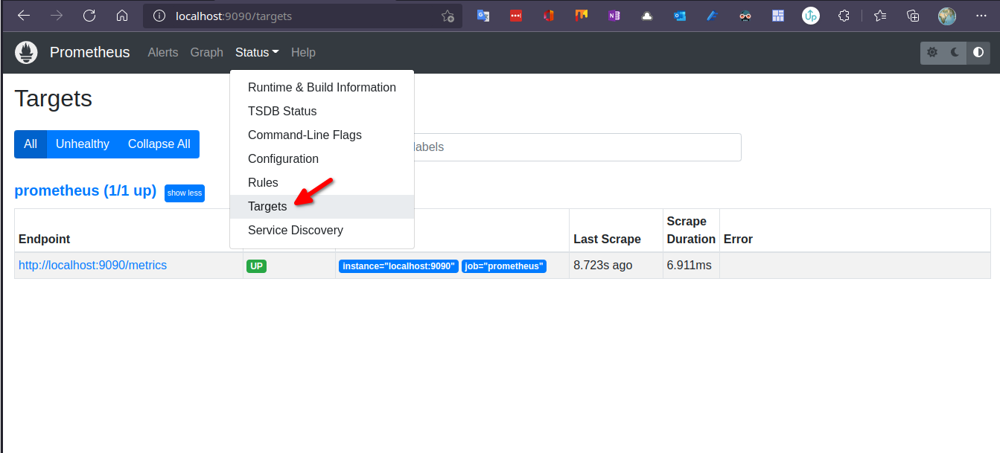

# Prometheus Kurulum

Kurulum için resmi sayfasında iki seçenek mevcut

- Doğrudan indirip çalıştırabilirsiniz. İndirmek için [şu sayfaya](https://prometheus.io/download/) gidiniz. İndirmeyi bitirdikten sonra dosyaları zip'den çıkarıp prometheus dosyasını çalıştırmak yeterli olacaktır. Bütün işletim sistemlerini desteklemektedir.
- Docker Image üzerinden çalıştırabilirsiniz. Bunu için Dockerhub'daki [resmi sayafasından](https://hub.docker.com/r/prom/prometheus) uygun versiyonu çalıştırmanız yeterli olacaktır. 

Ben v2.35.0 Linux Docker versiyonunu kullanıyor olacağım. Ancak siz istediğiniz şekilde kurulum yapabilirsiniz. Bu durum ileride işleyeceğimiz konuları etkileyecektir.

Alttaki komut ile Linux üzerinde Docker ile kurulumunuzu yapabilirsiniz.

```shell

docker volume create prometheusfiles

docker run -d -p 9090:9090  -v prometheusfiles:/etc/prometheus  prom/prometheus:v2.35.0
```
Kurulum dizininde prometheus.yml adında bir dosya olmalı. Eğer Docker ile devam ediyorsanız alttaki komutla bu doyanın bulunduğu dizin öğrenebilirsiniz. Aşağıda kendi bilgisayarım için oluşturulan path'i görüyorsunuz. __/var/lib/docker/volumes/prometheusfiles/_data__ dizinindeki prometheus.yml dosyasına ulaşabilirsiniz.

```shell

# sonuç
docker volume inspect prometheusfiles
[
    {
        "CreatedAt": "2022-04-26T18:09:30+03:00",
        "Driver": "local",
        "Labels": {},
        "Mountpoint": "/var/lib/docker/volumes/prometheusfiles/_data",
        "Name": "prometheusfiles",
        "Options": {},
        "Scope": "local"
    }
]


```

Altta ilk kurulumla gelen varsayılan ayları görebilirsiniz.


```yml

# global ayarlar
global:
  scrape_interval: 15s # 15 saniyede bir kaynaklardan verileri topla
  evaluation_interval: 15s # 15 saniyede bir verileri belirtilen kurallara göre verilier işle


# Alertmanager ayarları. Şuan kurulu değil
alerting:
  alertmanagers:
    - static_configs:
        - targets:
          # - alertmanager:9093

# global ayarlada evaluation_interval ayarıdna belirtilen zama gore alttaki kuralları yükle
rule_files:
  # - "first_rules.yml"
  # - "second_rules.yml"

# en az bir adet veri kaynağı olmalı. varsayılan olarak prometheus kendini eklemiş
scrape_configs:
  - job_name: "prometheus"

    static_configs:
      - targets: ["localhost:9090"]

```

Tarayıcı üzerinde _http://localhost:9090_ adresinden Prometheus'un anasayfasına ulaşabilirsiniz.



sayfa üzerinde Targets menüsünde Prometheus'un kendi kendini bir target olarak eklediğini görebiliriz. Adresi (http://localhost:9090/metrics) tarayıcıda açacak olursak metrikleri görebiliriz.


