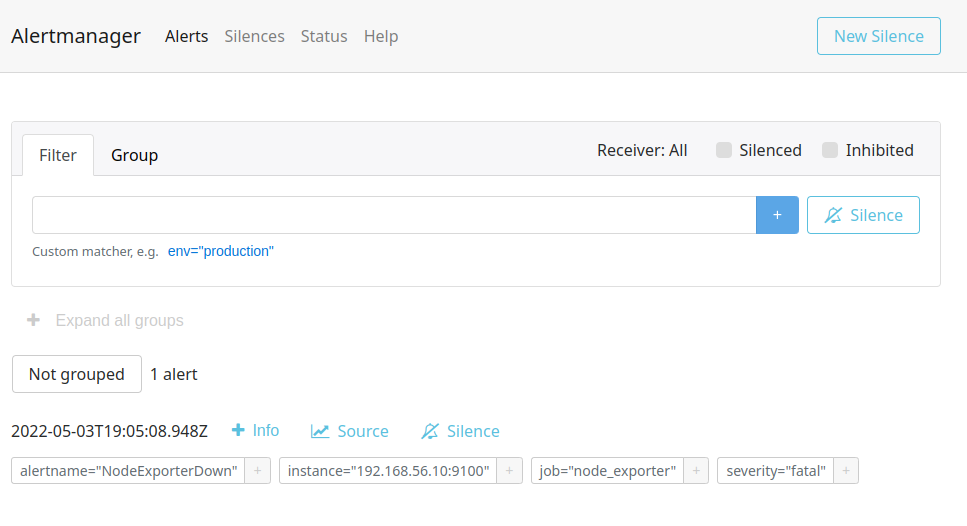
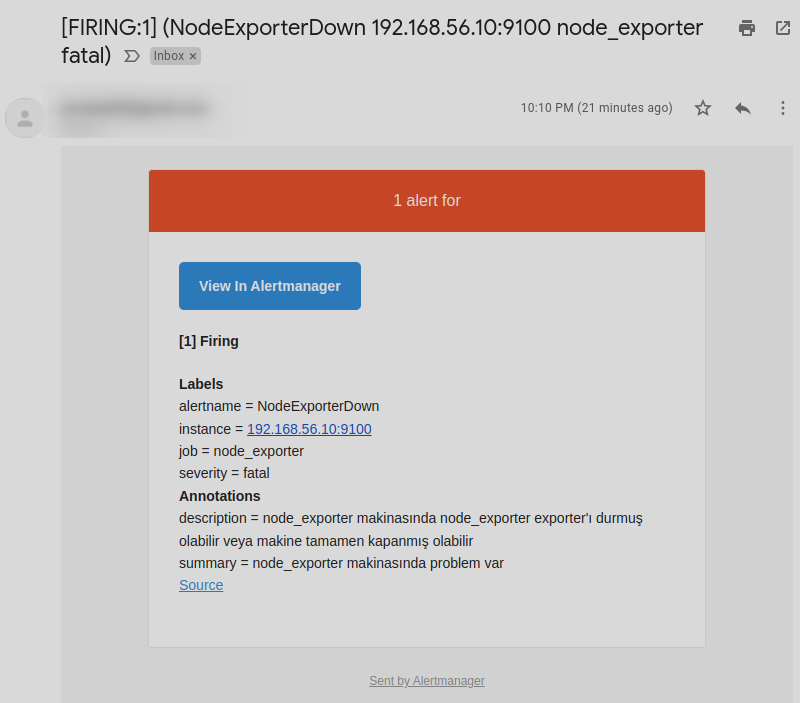

### Alertmanager Kurulumu ve Notification

[Alertmanager](https://github.com/prometheus/alertmanager) da aynı Prometheus gibi ayrı bir araç ve kurup çalıştırılması gerekiyor. Yazıyı hazırladığım zaman en son 0.24.0 versiyonu yayınlanmıştı. [Resmi sayfasından](https://prometheus.io/download/#alertmanager) işletim sistemimiz için uygun olan dosyayı indiriyoruz extract ediyoruz.

Dosyaları çıkarttıktan sonra doğrudan alertmanager dosyasını çalıştırmamız yeterli olacaktır.

Alttaki komut ile Linux üzerinde Docker ile kurulumunuzu yapabilirsiniz.


```shell

docker volume create alermanagerfiles

docker run -d -p 9093:9093  -v alermanagerfiles:/etc/alertmanager  prom/alertmanager:v0.24.0
```
Kurulum dizininde alertmanager.yml adında bir dosya olmalı. Eğer Docker ile devam ediyorsanız alttaki komutla bu doyanın bulunduğu dizin öğrenebilirsiniz. Aşağıda kendi bilgisayarım için oluşturulan path'i görüyorsunuz. __/var/lib/docker/volumes/alermanagerfiles/_data__ dizinindeki alertmanager.yml dosyasına ulaşabilirsiniz.

```shell

# sonuç
docker volume inspect alermanagerfiles
[
    {
        "CreatedAt": "2022-05-02T22:02:13+03:00",
        "Driver": "local",
        "Labels": {},
        "Mountpoint": "/var/lib/docker/volumes/alermanagerfiles/_data",
        "Name": "alermanagerfiles",
        "Options": {},
        "Scope": "local"
    }
]
```

alertmanager.yml dosyası

```yml
route:
  group_by: ['alertname']
  group_wait: 30s
  group_interval: 5m
  repeat_interval: 1h
  receiver: 'web.hook'
receivers:
  - name: 'web.hook'
    webhook_configs:
      - url: 'http://127.0.0.1:5001/'
inhibit_rules:
  - source_match:
      severity: 'critical'
    target_match:
      severity: 'warning'
    equal: ['alertname', 'dev', 'instance']
```
Şimdi alertmanager'ı Prometheus'a tanıtalım.

Prometeheus.yml dosyamızı açıyoruz ve alttaki düzenlemeyi yapıyoruz.


```yml
... kıdaltıldı
# Alertmanager configuration
alerting:
  alertmanagers:
    - static_configs:
        - targets:
            - localhost:9093


...kısaltıldı
```
daha sonra prometheus.yml dosyamızı refresh ediyoruz yani tekrar yüklüyoruz.

- Eğer Prometheus'u çalıştırmak için Docker kullanmadıysanız _http://localhost:9090/-/reload_ adresine POST veya PUT çağrısı yapmamız gerekiyor. POST çağrısı için curl komutunu bütün işletim sistemlerinde kullanabiliriz. Ancak bu POST çağrısını Prometheus'a yaptığımızda konfigürasyonun refresh olabilmesi için _Lifecycle API_'sini enable etmemiz gerekiyor. Bunun için de Prometheus'u terminalden çalıştırırken _--web.enable-lifecycle_ parametresini eklemek gerekiyor. Daha sonra alttaki komutla refresh edebilirsiniz her değişikliğinizde.

```
curl -X POST http://localhost:9090/-/reload
```

- Eğer Prometheus'u benim gibi Docker kullanarak çalıştırdıysanız o zaman alttaki komutla Prometheus'u restart etmeden konfigürasyonunuzu refresh edebilirsiniz.

```
docker exec <docker_container_id> killall -HUP prometheus
```


Artık tarayıcımızdan kontrol edebiliriz.


Alertmanager ile ilgili tüm konfigürasyon ayaları için [resmi sayfasını](https://prometheus.io/docs/alerting/latest/configuration/#:~:text=Alertmanager%20can%20reload%20its%20configuration,to%20the%20%2F%2D%2Freload%20endpoint.) ziyaret ediniz.

#### Gmail ile Notification

Gmail üzerinde mail gönderebilmek için öncelikle alttaki ki URL tarayıcıda açıp gerekli izinleri vermeniz grekiyor.
- https://myaccount.google.com/lesssecureapps
- https://www.google.com/accounts/DisplayUnlockCaptcha 


Daha sonra alertmanager.yml dosyamızın içini tamamen temizleyip alttaki kodları kopyalıyoruz. Mail adreslerini ve şifreyi kendi ayarlarınızla değiştiriniz.

```yml

global:
  resolve_timeout: 1m

route:
  group_by: ["mail_alert_group"]
  receiver: email_router

receivers:
- name: email_router
  email_configs:
  - to: 'to_mail@gmail.com'
    from: 'from_mail@gmail.com'
    smarthost: 'smtp.gmail.com:587'
    auth_username: 'from_mail'
    auth_identity: 'from_mail'
    auth_password: 'p@ssword'

```


[Kaynak 1](https://prometheus.io/docs/alerting/latest/notification_examples/), [Kaynak 2](https://www.robustperception.io/sending-email-with-the-alertmanager-via-gmail), [Kaynak 3](https://stackoverflow.com/questions/35637533/how-do-i-tell-prometheus-alertmanager-to-send-email-through-gmails-smtp-server), [Kaynak 4](https://www.robustperception.io/using-labels-to-direct-email-notifications)


Daha sonra alertmanager.yml dosyamızı tekrar yüklememiz lazım bunun için Prometheus'da da yaptığımız yöntemi kullanacağız. Ancak öncelikle yaptığımız konfigürasyonun doğrulunu check edelim.

```sh
amtool check-config alertmanager.yml

# sonuç

# Checking 'alertmanager.yml'  SUCCESS
# Found:
#  - global config
#  - route
#  - 0 inhibit rules
#  - 1 receivers
#  - 0 templates


```
Artık tekrar yükleme yapabiliriz.


- Eğer Alertmanager'ı çalıştırmak için Docker kullanmadıysanız _http://localhost:9093/-/reload_ adresine POST veya PUT çağrısı yapmamız gerekiyor. POST çağrısı için curl komutunu bütün işletim sistemlerinde kullanabiliriz.Alttaki komutla refresh edebilirsiniz her değişikliğinizde.

```
curl -X POST http://localhost:9090/-/reload
```

- Eğer Alertmanager'ı benim gibi Docker kullanarak çalıştırdıysanız o zaman alttaki komutla Alertmanager'ı restart etmeden konfigürasyonunuzu refresh edebilirsiniz.

```
docker exec <docker_container_id> killall -HUP alertmanager
```
Node_exporter için yazdığımız alert kuralını tetiklemek için sanal makinamızda çalışan node_exporter'ı stop ediyoruz.

30 saniye sonra Alertmanager üzerinde alttaki alert'i görüyor olacağız.



Mailimiz kontrol edecek olursak alert'in geldiğini görebiliriz.




#### Slack ile Notification

#### Templating

- https://prometheus.io/docs/prometheus/latest/configuration/template_reference/
- https://prometheus.io/docs/alerting/latest/notifications/
- https://prometheus.io/docs/prometheus/latest/configuration/template_examples/
