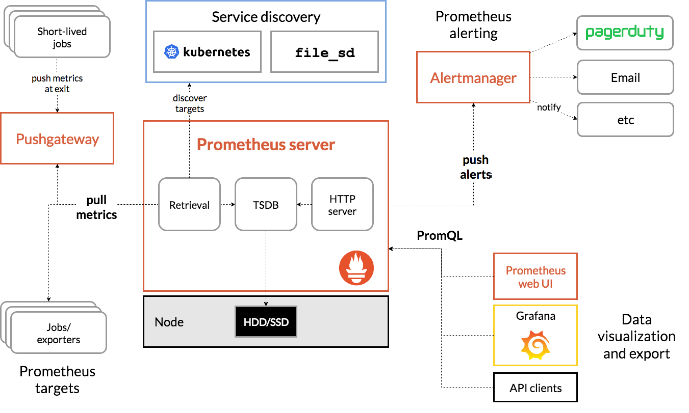
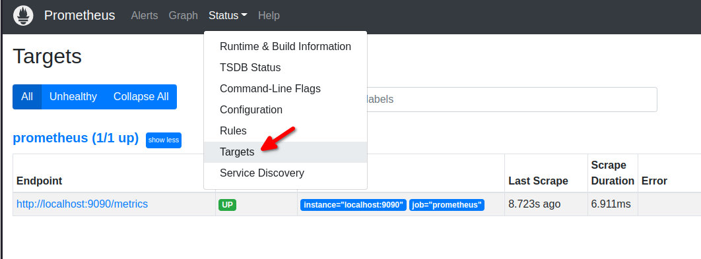

# Prometheus'a Giriş (Prometheus Öğreniyoruz 1)

Merhaba arkadaşlar

Bu yazı serimizde açık kaynak monitoring ve alerting sistemi olan Prometheus'u öğrenmeye çalışacağız.

Yazının diğer makaleleri için alttaki linkleri kullanabilirsiniz.
- [Prometheus'a Giriş](1.prometheus-nedir.md)
- [Prometheus Instrumentation ve Node Exporter Kullanımı](2.instrumentation.md)
- [PromQL Kullanımı](3.quering.md)
- [Prometheus Kural Tanımlama](4.configuring_rules.md)
- [Prometheus Alertmanager Kullanımı](5.alertmanager.md)
- [Prometheus Blackbox Exporter Kullanımı](6.blackbox_exporter.md)
- [Prometheus Pushgateway Exporter Kullanımı](7.pushgateway.md)
- [Prometheus Service Discovery](8.service_discovery.md)
- [Prometheus Grafana Entegrasyonu](9.grafana_integration.md)

[Prometheus](https://prometheus.io/docs/introduction/overview/), [SoundCloud](https://soundcloud.com/) firması tarafından Go dili ile geliştirilmiş, açık kaynak bir izleme (monitoring) ve uyarı (alerting) sistemidir.

**Temel bazı özellikleri**

- mMetrik adı ve anahtar/değer çiftleriyle tanımlanan zaman serisi verileriyle çok boyutlu bir veri modeli sunar.
- PromQL dili ile çok boyutluluktan yaralanma imkanı sağlar. PromQL read-only bir sorgulama dilidir. 
- Veri  toplama işlemlerini HTTP üzerinden pull metodu ile yapar.
- Veri gönderme işlemlerini de ara bir katman yardımıyla push metodu ile yapar.
- Hedefleri (targets) [service discovery](https://en.wikipedia.org/wiki/Service_discovery) veya statik konfigürasyon ile yapabilir.
- Çoklu grafik modu ve gösterge tablosu vardır.
- Distributed yapıyı desteklemez tek sunucuda çalışır.
- [Alertmanager](https://prometheus.io/docs/alerting/latest/alertmanager/) adında dahili uyarı (alert) sistemi vardır.


Kubernetes'den sonra ikinci [CNCF](https://www.cncf.io/) projesi olmayı başarmıştır. Sektörde monitoring aracı olarak standart olmayı başarmıştır ve en çok kullanılan programlama dillerini desteklemektedir. 

# Terminolojiler

- **metric**: zamana göre değisen sayısal değerlerdir. Dört tip metric vardır
  - counter (sayaç): değeri yalnızca yeniden başlatıldığında artırılabilen veya sıfırlanabilen tek bir monoton artan sayacı temsil eden kümülatif bir ölçümdür. Örneğin, sunulan isteklerin, tamamlanan görevlerin veya hataların sayısını temsil etmek için bir sayaç kullanabilirsiniz.
  - gauge (gösterge): keyfi olarak yukarı ve aşağı gidebilen tek bir sayısal değeri temsil eden bir ölçümdür.
  - histogram : gözlemleri (genellikle istek süreleri veya yanıt boyutları gibi metric'leri) örnekler ve bunları yapılandırılabilir paketlerde sayar. Ayrıca, gözlemlenen tüm değerlerin bir toplamını sağlar.
  - summary: histograma benzer şekilde, bir özet örnek gözlemler. Ayrıca toplam gözlem sayısı ve tüm gözlenen değerlerin bir toplamını sağlarken, kayan bir zaman penceresi üzerinden yapılandırılabilir nicelikleri hesaplar.
- **target** : monitor edilecek hedef sistemi ifade eder
- **alert manager**: Örneğin Prometheus server vb istemcilerden gönderilen alert'leri yönetir. Gelen alert'lerin işlenmesi ve alert alıcılarına (örneğin email, sms, api, vb) yönlendirir.
- instance : TODO
- job: TODO

# Prometeus Nasıl Çalışır?

[resim kaynak](https://prometheus.io/docs/introduction/overview/)

- **prometeus server**: üç bölümden oluşur
  - retrieval: target'lardan verileri alır ve prometheus üzerindeki local time series db'ye yazar
  - TSDB:time series database
  - http server: TSDB üzerindeki verileri diğer araçlara sunar (örneğin grafana)
- **job/exporters**: Prometehus metric'leri pull metodu ile kendisi target node'lardan toplar. Target'lar push yapmazlar.
- **pushgateways**: bazı metric'ler pull metodu ile toplanmaya elverişli olmayabilir bu gibi durumlarda bu metod kullanılır. Pull yapılabilen ara katman olarak çalışır.
- **service discovery**: izlenecek target'lar ve metric'ler service discovery ile belirlenir. Bunun için iki yönetem vardır. biri statik bir konfigürasyo dosyası ile ayarlamak diğeri ise service discovery ile dinamik olarak eklenen ve silinen target'ları bir veri tabanında tutarak Prometheus'u haberdar etmektir.  
- **prometheus web ui**: grafana, api, prometheus gui vb client'lara veri sunmak için vardır
-  **alert manager**: alert'leri alıcılara ulaştırır. Örneğin email, sms servisi, api vb

Uygulamaları yapabilmek için ön şartlarımız biraz [Vagrant](https://learn.hashicorp.com/collections/vagrant/getting-started) ve biraz [yaml](https://www.cloudbees.com/blog/yaml-tutorial-everything-you-need-get-started) dosya formatı hakkında bilgi sahibi olmak. Hiç bilmiyorsanız da problem değil ezberden ne deniliyorsa yaparsanız da olur.

# Prometheus Kurulum

Kurulum için resmi sayfasında iki seçenek mevcut

- Doğrudan indirip çalıştırabilirsiniz. İndirmek için [şu sayfaya](https://prometheus.io/download/) gidiniz. İndirmeyi bitirdikten sonra dosyaları zip'den çıkarıp prometheus dosyasını çalıştırmak yeterli olacaktır. Bütün işletim sistemlerini desteklemektedir.
- Docker Image üzerinden çalıştırabilirsiniz. Bunu için Dockerhub'daki [resmi sayafasından](https://hub.docker.com/r/prom/prometheus) uygun versiyonu çalıştırmanız yeterli olacaktır. 

Ben v2.35.0 Linux Docker versiyonunu kullanıyor olacağım. Ancak siz istediğiniz şekilde kurulum yapabilirsiniz. Bu durum ileride işleyeceğimiz konuları etkileyecektir.

Alttaki komut ile Linux üzerinde Docker ile kurulumunuzu yapabilirsiniz.

```shell

docker volume create prometheusfiles

docker run -d -p 9090:9090  -v prometheusfiles:/etc/prometheus  prom/prometheus:v2.35.0
```
Kurulum dizininde prometheus.yml adında bir dosya olmalı. Eğer Docker ile devam ediyorsanız alttaki komutla bu doyanın bulunduğu dizin öğrenebilirsiniz. Aşağıda kendi bilgisayarım için oluşturulan path'i görüyorsunuz. __/var/lib/docker/volumes/prometheusfiles/_data__ dizinindeki prometheus.yml dosyasına ulaşabilirsiniz.

```shell

# sonuç
docker volume inspect prometheusfiles
[
    {
        "CreatedAt": "2022-04-26T18:09:30+03:00",
        "Driver": "local",
        "Labels": {},
        "Mountpoint": "/var/lib/docker/volumes/prometheusfiles/_data",
        "Name": "prometheusfiles",
        "Options": {},
        "Scope": "local"
    }
]


```

Altta ilk kurulumla gelen varsayılan ayları görebilirsiniz.


```yml

# global ayarlar
global:
  scrape_interval: 15s # 15 saniyede bir kaynaklardan verileri topla
  evaluation_interval: 15s # 15 saniyede bir verileri belirtilen kurallara göre verilier işle


# Alertmanager ayarları. Şuan kurulu değil
alerting:
  alertmanagers:
    - static_configs:
        - targets:
          # - alertmanager:9093

# global ayarlada evaluation_interval ayarıdna belirtilen zama gore alttaki kuralları yükle
rule_files:
  # - "first_rules.yml"
  # - "second_rules.yml"

# en az bir adet veri kaynağı olmalı. varsayılan olarak prometheus kendini eklemiş
scrape_configs:
  - job_name: "prometheus"

    static_configs:
      - targets: ["localhost:9090"]

```

Tarayıcı üzerinde _http://localhost:9090_ adresinden Prometheus'un ana sayfasına ulaşabilirsiniz.



sayfa üzerinde Targets menüsünde Prometheus'un kendi kendini bir target olarak eklediğini görebiliriz. Adresi (http://localhost:9090/metrics) tarayıcıda açacak olursak metrikleri görebiliriz.

Yazının diğer makaleleri için alttaki linkleri kullanabilirsiniz.
- [Prometheus'a Giriş](1.prometheus-nedir.md)
- [Prometheus Instrumentation ve Node Exporter Kullanımı](2.instrumentation.md)
- [PromQL Kullanımı](3.quering.md)
- [Prometheus Kural Tanımlama](4.configuring_rules.md)
- [Prometheus Alertmanager Kullanımı](5.alertmanager.md)
- [Prometheus Blackbox Exporter Kullanımı](6.blackbox_exporter.md)
- [Prometheus Pushgateway Exporter Kullanımı](7.pushgateway.md)
- [Prometheus Service Discovery](8.service_discovery.md)
- [Prometheus Grafana Entegrasyonu](9.grafana_integration.md)


