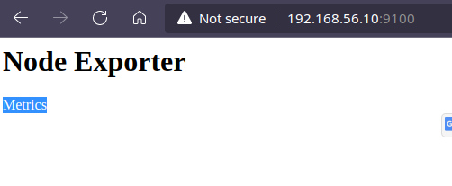
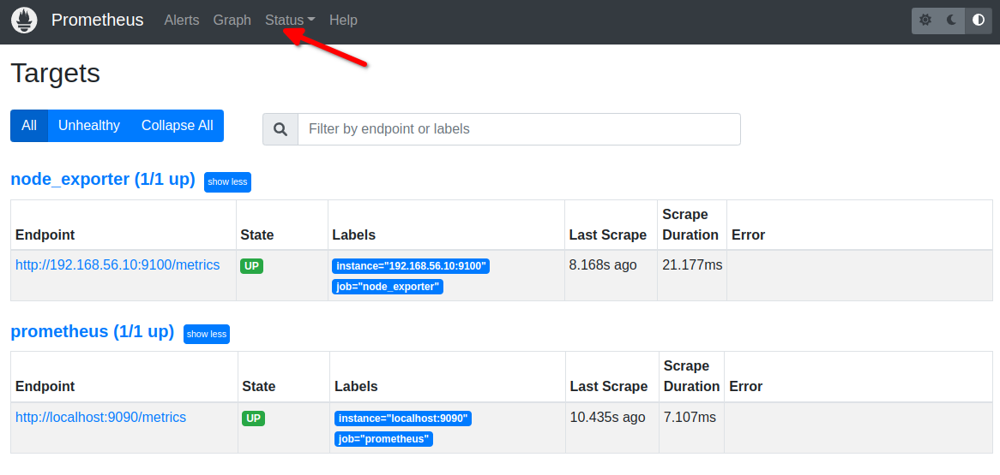
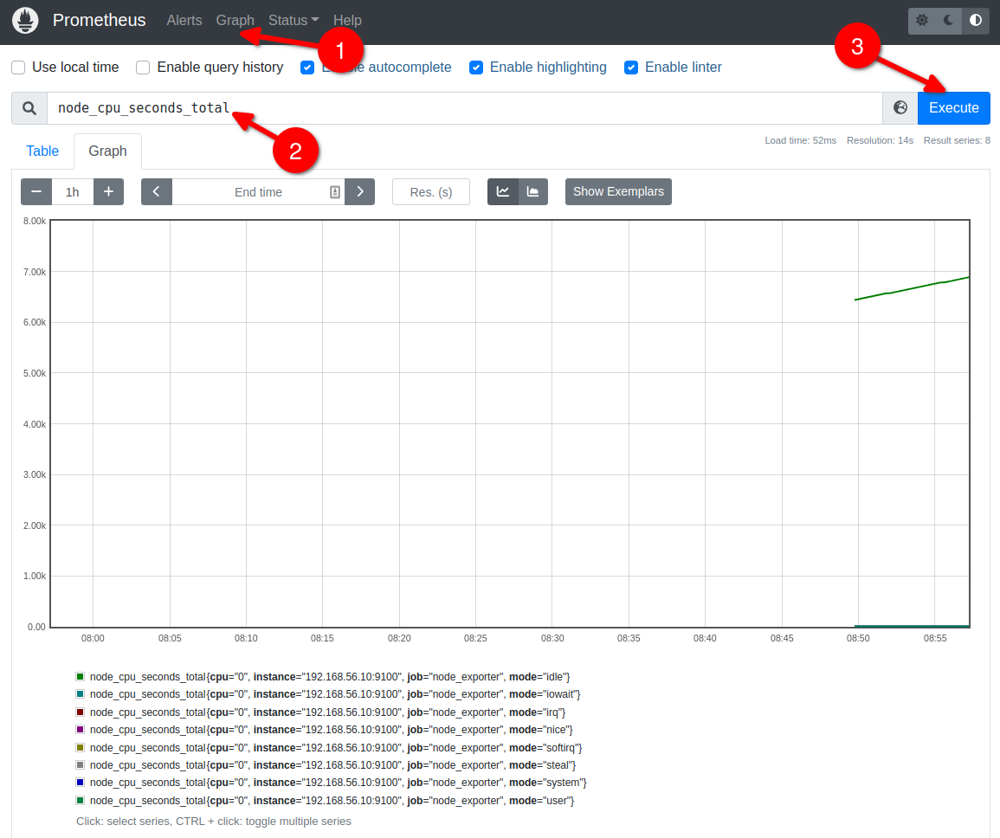

# Prometheus Instrumentation ve Node Exporter (Prometheus Öğreniyoruz 2)

Yazının diğer makaleleri için alttaki linkleri kullanabilirsiniz.
- [Prometheus'a Giriş](1.prometheus-nedir.md)
- [Prometheus Instrumentation ve Node Exporter Kullanımı](2.instrumentation.md)
- [PromQL Kullanımı](3.quering.md)
- [Prometheus Kural Tanımlama](4.configuring_rules.md)
- [Prometheus Alertmanager Kullanımı](5.alertmanager.md)
- [Prometheus Blackbox Exporter Kullanımı](6.blackbox_exporter.md)
- [Prometheus Pushgateway Exporter Kullanımı](7.pushgateway.md)
- [Prometheus Service Discovery](8.service_discovery.md)
- [Prometheus Grafana Entegrasyonu](9.grafana_integration.md)

[Instrumentation](https://prometheus.io/docs/instrumenting/clientlibs/) kelimesini doğrudan çevirecek olursak enstrümantasyon olarak çok da anlamlı görünmüyor. Biraz açacak olursak aslında orkestrasyon, araç, alet vb anlamlarına geliyor. Prometheus terminolojisi olarak bakacak olursak metrik toplamak için gerekli olan araçların (kütüphane, exporter) deploy edilmesini ifade etmektedir.

Versiyon v2.35.0 için resmi olarak desteklediği diller
- Go
- Java or Scala
- Python
- Ruby
- Rust

Community tarafından Prometheus desteği ile geliştirilen diller

- Bash
- C
- C++
- Common Lisp
- Dart
- Elixir
- Erlang
- Haskell
- Lua for Nginx
- Lua for Tarantool
- .NET / C#
- Node.js
- OCaml
- Perl
- PHP
- R

Prometheus http üzerinden uygulamaya endpoint'lerine eriştiğinde ilgili kütüphanelerle yazılmış sistem bütün metrikleri Prometheus'a verir.  Eğer desteklenmeyen bir sistem ile çalışılıyorsa support edilen [exposition formatlardan](https://prometheus.io/docs/instrumenting/exposition_formats/) biriyle metrikler expose edilebilir. Eğer kendi kütüphanenizi yazmak isterseniz de [resmi dokümanları](https://prometheus.io/docs/instrumenting/writing_clientlibs) takip edebilirsiniz.


## Exporters

Tabii ki büyük çoğunlukla Prometheus'u kaynak koddan ziyade halihazırla çalışır durumda olan sistem veya uygulamalara entegre ederek kullanmayı tercih edeceğiz. Örneğin Linux ve Windows işletim sistemlerinin sunmuş olduğu metrikleri izlemek isteyebiliriz. Yada Sql Server veya Postgres gibi veri tabanlarını, Kubernetes'i, network cihazlarını, storage sistemlerini vb doğrudan kaynak koduna dokunmadığımız uygulamaları da sistemleri de monitör etmek isteyeceğiz. İşte tam olarak Exporter'larda bu işi yapmak için varlar.

Exporter'lar ilgili sistemden metrikleri toplayarak Prometheus metrikleri haline dönüştürür ve Pormetheus'a sunarlar.

[Exporter](https://prometheus.io/docs/instrumenting/exporters/)'lar buraya yazılamayacak kadar çok uygulama ve sistem desteği sunmaktadır. Ayrıca resmi sayfasında bulunmayan bir çok sistem için de community açık kaynak bir çok exporter sunmaktadır.

İsterseniz Prometheus'un resmi exporter'larından biri olan [Node_Exporter'ı](https://prometheus.io/download/) kullanarak Linux bir makinayı monitor edelim. [Windows Makineler](https://github.com/prometheus-community/windows_exporter) için Windows_Exporter'ı kullanabilirsiniz.

Linux için de Vagrant kullanacağız. Kurulum için [resmi sayfaları](https://www.vagrantup.com/downloads) ziyaret edebilirsiniz.

Kurulumu bitirdikten sonra alttaki konfigürasyonu Vagranfile adında bir dosya oluşturup içine kopyaladıktan sonra terminalde bu dizinde iken _vagrant up_ komutunu çalıştırın.

```vagrantfile
# -*- mode: ruby -*-
# vi: set ft=ruby :

# centos kurmak isteseniz generic/ubuntu2004 yerine generic/centos8  yazmanız yeterli

Vagrant.configure("2") do |config|

    # node1
    config.vm.define "node1" do |node1|
        node1.vm.box = "generic/ubuntu2004"
        node1.vm.hostname="node1"
        node1.vm.network "private_network", ip: "192.168.56.10"
        
        node1.vm.provider :virtualbox do |lv|
           lv.memory=1024
           lv.cpus=1
        end 
     end
        
    end
```

Daha sonra aynı terminal üzerinden __vagrant ssh node1__ komutu ile bağlanıyoruz. Windows için ssh kurulumunu [şu sayfadan](https://docs.microsoft.com/en-us/windows-server/administration/openssh/openssh_install_firstuse) yapabilirsiniz. 


Artık exporter'umuzu yükleyebiliriz. 

```shell
wget https://github.com/prometheus/node_exporter/releases/download/v1.3.1/node_exporter-1.3.1.linux-amd64.tar.gz

tar -xf node_exporter-1.3.1.linux-amd64.tar.gz

cd node_exporter-1.3.1.linux-amd64 

./node_exporter

```

Exporter'ı çalıştırdıktan sonra aşağıdakine benzer bir sonuç almalıyız

```
......kısaltıldı


ts=2022-04-29T07:12:27.699Z caller=node_exporter.go:115 level=info collector=schedstat
ts=2022-04-29T07:12:27.699Z caller=node_exporter.go:115 level=info collector=sockstat
ts=2022-04-29T07:12:27.699Z caller=node_exporter.go:115 level=info collector=softnet
ts=2022-04-29T07:12:27.700Z caller=node_exporter.go:115 level=info collector=stat
ts=2022-04-29T07:12:27.700Z caller=node_exporter.go:115 level=info collector=tapestats
ts=2022-04-29T07:12:27.700Z caller=node_exporter.go:115 level=info collector=textfile
ts=2022-04-29T07:12:27.700Z caller=node_exporter.go:115 level=info collector=thermal_zone
ts=2022-04-29T07:12:27.701Z caller=node_exporter.go:115 level=info collector=time
ts=2022-04-29T07:12:27.701Z caller=node_exporter.go:115 level=info collector=timex
ts=2022-04-29T07:12:27.701Z caller=node_exporter.go:115 level=info collector=udp_queues
ts=2022-04-29T07:12:27.701Z caller=node_exporter.go:115 level=info collector=uname
ts=2022-04-29T07:12:27.702Z caller=node_exporter.go:115 level=info collector=vmstat
ts=2022-04-29T07:12:27.702Z caller=node_exporter.go:115 level=info collector=xfs
ts=2022-04-29T07:12:27.702Z caller=node_exporter.go:115 level=info collector=zfs
ts=2022-04-29T07:12:27.703Z caller=node_exporter.go:199 level=info msg="Listening on" address=:9100
ts=2022-04-29T07:12:27.706Z caller=tls_config.go:195 level=info msg="TLS is disabled." http2=false


```

host makinemizde tarayıcıda  _http://192.168.56.10:9100/_ adresini girdiğimizde alttaki gibi ekran görmemiz gerekiyor



Prometheus'un metrikleri toplayabilmesi için konfigürasyon dosyasına en alta ekleme yapmalıyız.

```yml

# kısaltıldı

scrape_configs:
  - job_name: "prometheus"
    static_configs:
      - targets: ["localhost:9090"]

  - job_name: "node_exporter"
    static_configs:
      - targets: ["192.168.56.10:9100"]

```

Target sayfasında artık yeni eklediğimizi de görebiliriz. Eğer hata alacak olursanız Prometheus'u restart edebilirsiniz.



Eklenen metrikleri izlemek için alttaki adımları takip ediniz.



## Prometheus'u Restart Etmeden Konfigürasyonu Yeniden Yüklemek

Üstteki gibi bir exporter eklediğimizi düşünelim. Prod ortamında Prometheus'u restart edemeyeceğimiz için Prometheus bize bir yöntem sunuyor.

- Eğer Prometheus'u çalıştırmak için Docker kullanmadıysanız _http://localhost:9090/-/reload_ adresine POST veya PUT çağrısı yapmamız gerekiyor. POST çağrısı için curl komutunu bütün işletim sistemlerinde kullanabiliriz. Ancak bu POST çağrısını Prometheus'a yaptığımızda konfigürasyonun refresh olabilmesi için _Lifecycle API_'sini enable etmemiz gerekiyor. Bunun için de Prometheus'u terminalden çalıştırırken _--web.enable-lifecycle_ parametresini eklemek gerekiyor. Daha sonra alttaki komutla refresh edebilirsiniz her değişikliğinizde.

```
curl -X POST http://localhost:9090/-/reload
```

- Eğer Prometheus'u benim gibi Docker kullanarak çalıştırdıysanız o zaman alttaki komutla Prometheus'u restart etmeden konfigürasyonunuzu refreh edebilirsiniz.

```
docker exec <docker_container_id> killall -HUP prometheus
```
- Eğer Docker kullanmadıysanız ve yukarıdaki sistemi kurmak da istemiyorsanız aşağıdaki komutu da kullanabilirsiniz

```
killall -HUP prometheus
```
## Custom Exporter Yazmak

Öncelikle kullanacağımız dil için ilgili kütüphaneleri indirdikten sonra Prometheus'un aşağıda linkini verdim resmi dokümanın uygun şekilde exporter'ı yazabiliriz. Burada amacımız bir uygulama veya servis için Prometheus'un anlayacağı şekilde kodlama yapmak ve ilgili uygulamanın Prometheus tarafından metriklerinin çekilebilmesini (pull) sağlamak.

- Konu ile ilgili [resmi dokümanı](https://prometheus.io/docs/instrumenting/writing_exporters/) takip edebilirsiniz. Exporter yazım kuralları ve naming convension'lar için kesinlikle göz atmalısınız.
- [Dotnet ile custom exporter](https://github.com/prometheus-net/prometheus-net) yazımı
- [Python ile custom exporter](https://github.com/prometheus/client_python) yazımı
- [Go ile custom exporter](https://github.com/prometheus/client_golang) yazımı
- [Java ile custom exporter](https://github.com/prometheus/client_java) yazımı


Yazının diğer makaleleri için alttaki linkleri kullanabilirsiniz.
- [Prometheus'a Giriş](1.prometheus-nedir.md)
- [Prometheus Instrumentation ve Node Exporter Kullanımı](2.instrumentation.md)
- [PromQL Kullanımı](3.quering.md)
- [Prometheus Kural Tanımlama](4.configuring_rules.md)
- [Prometheus Alertmanager Kullanımı](5.alertmanager.md)
- [Prometheus Blackbox Exporter Kullanımı](6.blackbox_exporter.md)
- [Prometheus Pushgateway Exporter Kullanımı](7.pushgateway.md)
- [Prometheus Service Discovery](8.service_discovery.md)
- [Prometheus Grafana Entegrasyonu](9.grafana_integration.md)