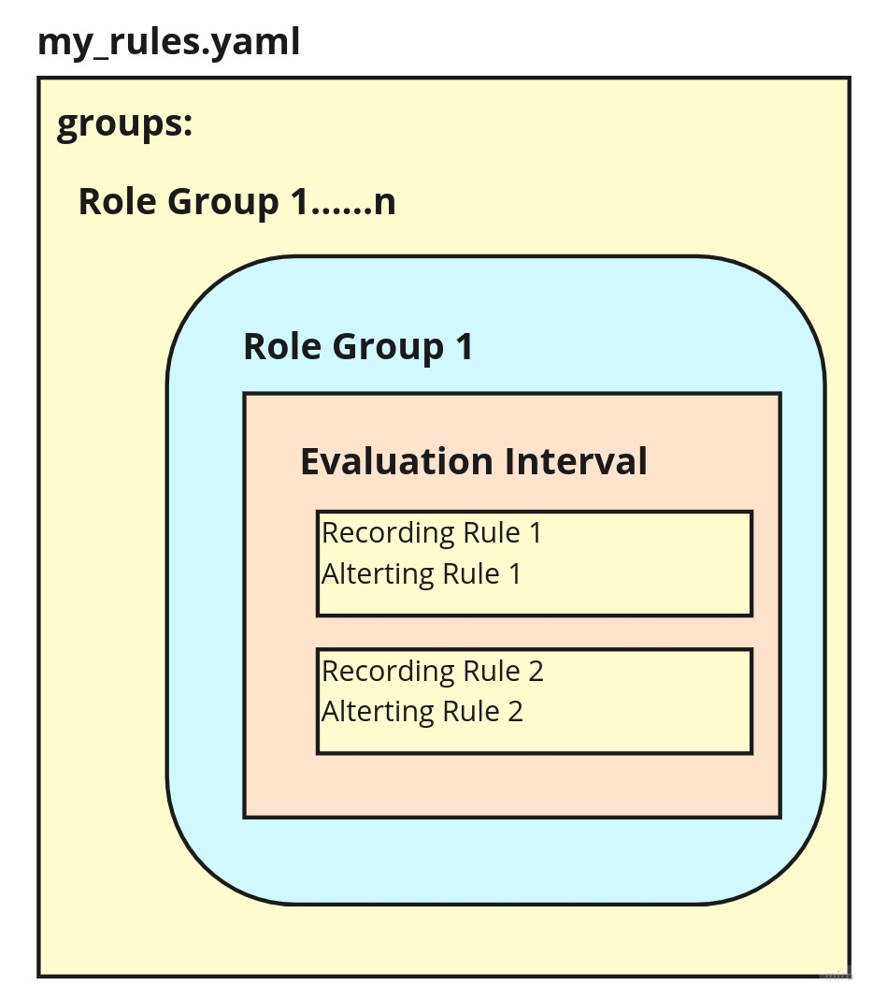
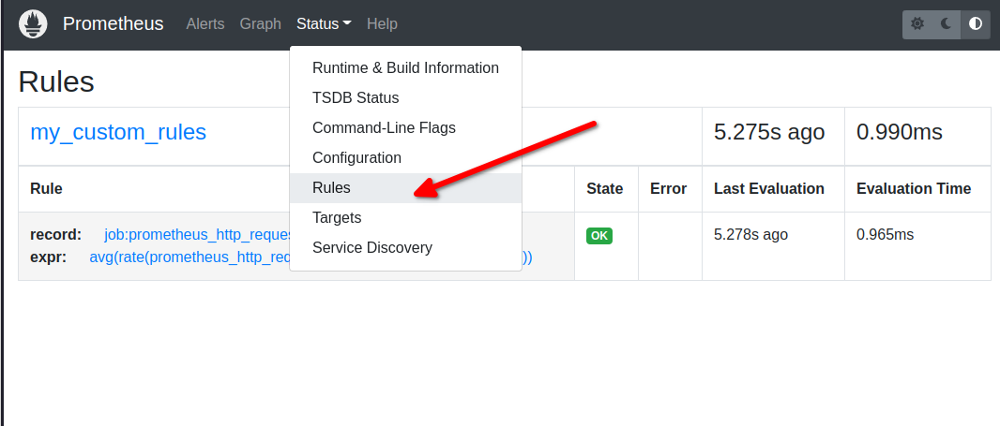
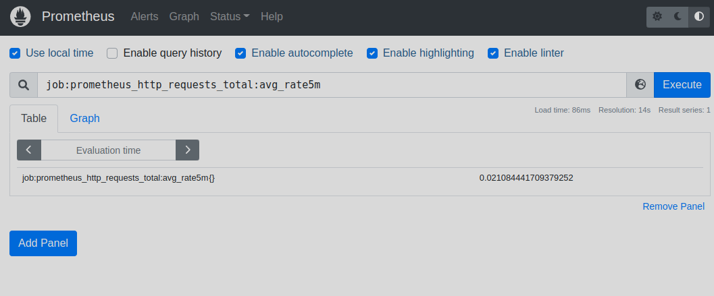
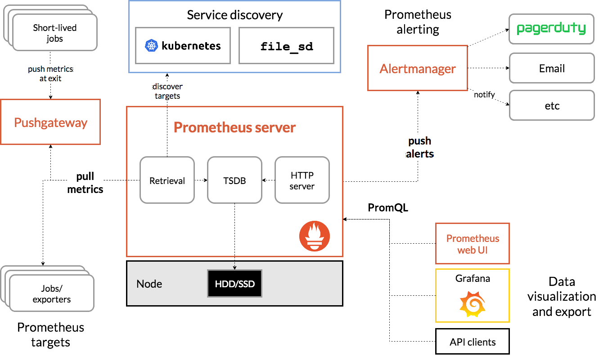
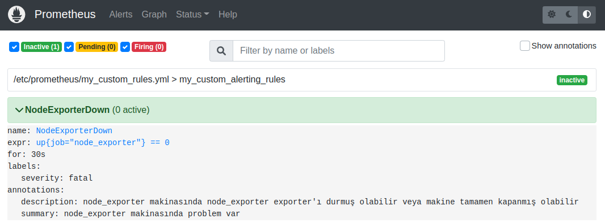
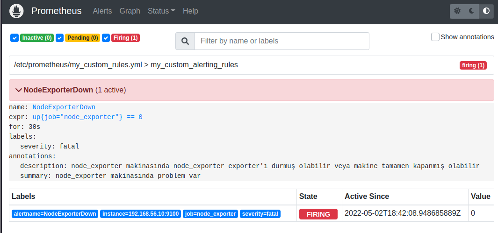

# Kural Tanımlama - Configuring Rules (Prometheus Öğreniyoruz 4)

Yazının diğer makaleleri için alttaki linkleri kullanabilirsiniz.
- [Prometheus'a Giriş](1.prometheus-nedir.md)
- [Prometheus Instrumentation ve Node Exporter Kullanımı](2.instrumentation.md)
- [PromQL Kullanımı](3.quering.md)
- [Prometheus Kural Tanımlama](4.configuring_rules.md)
- [Prometheus Alertmanager Kullanımı](5.alertmanager.md)
- [Prometheus Blackbox Exporter Kullanımı](6.blackbox_exporter.md)
- [Prometheus Pushgateway Exporter Kullanımı](7.pushgateway.md)
- [Prometheus Service Discovery](8.service_discovery.md)
- [Prometheus Grafana Entegrasyonu](9.grafana_integration.md)

Prometeheus iki tip kural tanımını destekler.
- Recording Rules
- Alerting Rules

Bu kurallar yaml uzantılı dosyalara yazılır ve dosya isimleri de Prometheus Configuration dosyası içinde rule_files bölümüne eklenir.


Hazırlanan yaml dosyasını işleyen Prometheus topladığı zaman serilerini kendi dosya sisteminde tutmaktadır. Ancak şunu hatırlatmakta fayda var, Prometheus bir Time Series Database değildir.

## Recording Rules

Sık ihtiyaç duyulan veya hesaplama açısından pahalı ifadeleri önceden hesaplamamıza ve sonuçlarını yeni bir zaman serisi kümesi olarak kaydetmemize olanak tanır. Önceden hesaplanmış sonucu sorgulamak, genellikle, her ihtiyaç duyulduğunda orijinal ifadeyi yürütmekten çok daha hızlı olacaktır. 

Bir kural grubunda (role group) recording ve alerting kuralları bulunur. Bir grup içindeki kurallar, aynı değerlendirme süresiyle düzenli aralıklarla sırayla çalıştırılır. Recording kurallarının adları, geçerli metrik adları olmalıdır (valid metric names). Uyarı kurallarının adları geçerli etiket değerleri olmalıdır (valid label values). 

Biraz karışık oldu ama örneklerle daha iyi anlayacağız.


```yml
groups:
  - name: my_rules
    rules:
      - record: node_memory_MemFree_percent
        expr: 100 - (100 * node_memory_MemFree_bytes / node_memory_MemTotal_bytes)
```
[dosya kaynak](https://www.devopsschool.com/blog/recording-rules-and-alerting-rules-exmplained-in-prometheus/)

Bu dosyayı Prometheus'un root dizinine koyup yine aynı dizinde olan **promtool** aracıyla valide ediyoruz.

```
./promtool check rules my_rules.yml
```
Burada hata almazsak artık prometheus.yml dosymıza ekleyebiliriz.

```yml

...  kısaltıldı

rule_files:
  - "my_rules.yml"

... kısaltıldı

```

Daha sonra önceki yazılarımızda bahsettiğimiz gibi konfigürasyon dosyamızı tekrar yüklemeliyiz.

Gerçek bir **recoding rule** dosyasını inceleyelim.


Recording rule yazılırken adı _level:metric:operation_  [isimlendirme kuralına](https://prometheus.io/docs/practices/rules/#naming-and-aggregation) uyularak yazılır.

- level: Kural çıktısında label ve metriğin aggregation düzeyini gösterir. Burada kasıt metriğin label'larıdır. Öneceki örnekklerimizde kulalnığımız job, handler, name, instancei path vb. bunlara örnektir. 
- metric: metrik adı
- operation: metriğe uygulanan operation listesi

Örnek rule name : path:request_failures_per_requests:ratio_rate5m

Bu örneğe göre  

- level: path
- metric: request_failures_per_requests
- operation: ratio_rate5m

Kurallarda özellikle interval zamanı beirtilmemişse default değer 1 dakikadır.


```yml

groups:
  - name: my_rules
    rules:

      Recording Rule Example 1
      ================================
      # Aggregating up requests per second that has a path label:
      - record: instance_path:requests:rate5m
        expr: rate(requests_total{job="myjob"}[5m])
      
      - record: path:requests:rate5m
        expr: sum without (instance)(instance_path:requests:rate5m{job="myjob"})
      
      Recording Rule Example 2
      ================================
      # Calculating a request failure ratio and aggregating up to the job-level failure ratio:
      - record: instance_path:request_failures:rate5m
        expr: rate(request_failures_total{job="myjob"}[5m])
      
      - record: instance_path:request_failures_per_requests:ratio_rate5m
        expr: |2
            instance_path:request_failures:rate5m{job="myjob"}
          /
            instance_path:requests:rate5m{job="myjob"}
      # Aggregate up numerator and denominator, then divide to get path-level ratio.
      - record: path:request_failures_per_requests:ratio_rate5m
        expr: |2
            sum without (instance)(instance_path:request_failures:rate5m{job="myjob"})
          /
            sum without (instance)(instance_path:requests:rate5m{job="myjob"})
      # No labels left from instrumentation or distinguishing instances,
      # so we use 'job' as the level.
      - record: job:request_failures_per_requests:ratio_rate5m
        expr: |2
            sum without (instance, path)(instance_path:request_failures:rate5m{job="myjob"})
          /
            sum without (instance, path)(instance_path:requests:rate5m{job="myjob"})
      Recording Rule Example 3
      ================================
      # Calculating average latency over a time period from a Summary:
      
      - record: instance_path:request_latency_seconds_count:rate5m
        expr: rate(request_latency_seconds_count{job="myjob"}[5m])
      
      - record: instance_path:request_latency_seconds_sum:rate5m
        expr: rate(request_latency_seconds_sum{job="myjob"}[5m])
      
      - record: instance_path:request_latency_seconds:mean5m
        expr: |2
            instance_path:request_latency_seconds_sum:rate5m{job="myjob"}
          /
            instance_path:request_latency_seconds_count:rate5m{job="myjob"}
      # Aggregate up numerator and denominator, then divide.
      - record: path:request_latency_seconds:mean5m
        expr: |2
            sum without (instance)(instance_path:request_latency_seconds_sum:rate5m{job="myjob"})
          /
            sum without (instance)(instance_path:request_latency_seconds_count:rate5m{job="myjob"})
      Recording Rule Example 5
      ================================
      # Calculating the average query rate across instances and paths is done using the avg() function:
      
      - record: job:request_latency_seconds_count:avg_rate5m
        expr: avg without (instance, path)(instance:request_latency_seconds_count:rate5m{job="myjob"})

```

[dosya kaynak](https://www.devopsschool.com/blog/recording-rules-and-alerting-rules-exmplained-in-prometheus/)


- **Gerçek Recording Rule Örneği**


Alttaki dokümanı Prometheus root klasörüne my_custom_rules adıyla kaydediyoruz. Docker kullanıyorsanız konteynerimizi çalıştırırken oluşturduğumuz volume dizinine oluşturabilirsiniz. Bendeki klasör yolu _/var/lib/docker/volumes/prometheusfiles/\_data_ olarak görünüyor.

Sizde bu dizini alttaki komutla bulabilirsiniz

```bash
docker volume inspect prometheusfiles
```

```yaml
groups:
  - name: my_custom_rules
    rules:
      - record: job:prometheus_http_requests_total:avg_rate5m
        expr: avg(rate(prometheus_http_requests_total{job="prometheus"}[5m]))
```
alttkai komutla dosyamızı check ediyoruz. Eğer docker kullanıyorsanız, container içinden de alttaki komutu çalıştırabilirsiniz.

Docker container'a giriş yapmak için alttaki komutu kullanabilirsiniz. Az önce oluşturduğumuz my_custom_rules.yml dosyası konteyner içinde _/etc/prometheus_ dizini altında. 

```
docker exec -it <container_id> sh
```
promtool aracı ile doayamızı check ediyoruz.

```bash
promtool check rules my_custom_rules.yml 

# sonuç
#Checking my_custom_rules.yml
#  SUCCESS: 1 rules found

```

Artık prometheus.yml dosyamıza ekleyebiliriz. 

prometheus.yml dosyasında alttaki satırları bulup dosya adımız ekliyoruz


```yml

...  kısaltıldı

rule_files:
  - "my_custom_rules.yml"

... kısaltıldı

```

Son olarak konfigürasyon dosyamızı tekrar yüklüyoruz. 

- Eğer Prometheus'u çalıştırmak için Docker kullanmadıysanız _http://localhost:9090/-/reload_ adresine POST veya PUT çağrısı yapmamız gerekiyor. POST çağrısı için curl komutunu bütün işletim sistemlerinde kullanabiliriz. Ancak bu POST çağrısını Prometheus'a yaptığımızda konfigürasyonun refresh olabilmesi için _Lifecycle API_'sini enable etmemiz gerekiyor. Bunun için de Prometheus'u terminalden çalıştırırken _--web.enable-lifecycle_ parametresini eklemek gerekiyor. Daha sonra alttaki komutla refresh edebilirsiniz her değişikliğinizde.

```
curl -X POST http://localhost:9090/-/reload
```

- Eğer Prometheus'u benim gibi Docker kullanarak çalıştırdıysanız o zaman alttaki komutla Prometheus'u restart etmeden konfigürasyonunuzu refresh edebilirsiniz.

```
docker exec <docker_container_id> killall -HUP prometheus
```

Artık tarayıcıdan recording kuralını kontrol edebiliriz.

Tarayıcımızda http://localhost:9090/rules adresine gittiğimizde alttaki ekranı görüyor olmalıyız.




Artık kural kural listesinden de çağırıp kullanabiliriz.



bu kural sonucunda alacağımız graph aslında daha önceden toplanıp kaydedilmiş verilerden oluşur bu nedenle daha hızlı çalışır. Eğer bu kural da yazmış olduğumuz expression'ı doğrudan çalıştırırsak zaten farklı sonuçlar getirdiğini görebiliriz. Çünkü expression anında hesaplama yapar.

```
avg(rate(prometheus_http_requests_total{job="prometheus"}[5m]))
```
Birden fazla kurallı bir yaml dosyası oluşturalım.

```yaml
groups:
  - name: my_custom_rules # group name
    rules:
      - record: job:prometheus_http_requests_total:avg_rate5m
        expr: avg(rate(prometheus_http_requests_total{job="prometheus"}[5m]))

      - record: job:prometheus_http_requests_total:max_rate5m
        expr: max(rate(prometheus_http_requests_total{job="prometheus"}[5m]))

  - name: my_custom_rules2 # group name
    rules:
      - record: job:prometheus_http_requests_total:avg_rate5m
        expr: avg(rate(prometheus_http_requests_total{job="prometheus"}[5m]))

      - record: job:prometheus_http_requests_total:max_rate5m
        expr: max(rate(prometheus_http_requests_total{job="prometheus"}[5m]))

```
Her bir grup sırasıyla ve her grup altındaki kurallarda kendi aralarında sırasıyla çalışırlar.

## Alerting Rules
      
[Alert](https://prometheus.io/docs/prometheus/latest/configuration/alerting_rules/)'lerin notification'a dönüşebilmesi için [Alertmanager](https://prometheus.io/docs/alerting/latest/alertmanager/)'ı kurmamız gerekiyor. Aşağıdaki şekilde de görüleceği üzere  Prometheus sunucusunun görevi notificaiton göndermek değil sadece alert üretmek.


[resim kaynak](https://prometheus.io/docs/introduction/overview/)


Alerting kuralları da recording kuralları ile yanı dosyaya yazılabileceği gibi ayrı dosyalara da yazılabilir. Biz daha önce oluşturduğumuz my_custom_rules.yml dosyasına yazacağız.

Test için yazabileceğimiz en pratik alert kuralı ilk yazımızda ayağa kaldırdığımız ve bu yazılarımızda kullandığımız sanal makinayı kapatarak alert üretmek. Biz de bunu yapıyor olacağız.

Daha önce oluşturduğumuz my_custom_rules.yml dosyasına yeni bir group oluşturup ona alerting kuralımızı ekleyelim. Tabii ki bunu yeni group oluşturmadan ilk group'a (my_custom_rules) da ekleyebilirdik.

Eğer sanal makinamız 30 saniyeden fazla down olursa alert oluşacak

```yml


groups:
  - name: my_custom_rules
    rules:
      - record: job:prometheus_http_requests_total:avg_rate5m
        expr: avg(rate(prometheus_http_requests_total{job="prometheus"}[5m]))

  - name: my_custom_alerting_rules
    rules:
      - alert: NodeExporterDown
        expr: up{job="node_exporter"} == 0
        for: 30s
        labels:
          severity: fatal
        annotations:
          summary: "node_exporter makinasında problem var"
          description: "node_exporter makinasında node_exporter exporter'ı durmuş olabilir veya makine tamamen kapanmış olabilir"

```
[kaynak](https://www.robustperception.io/alerting-on-down-instances)

Dosyamızı daha önce yaptığımız gibi check ediyoruz.

```
promtool check rules my_custom_rules.yml 
```
eğer sonuç SUCCESS dönerse prometheus.yml dosyamızı tekrar yüklüyoruz. yukarıda detaylı anlatımı var. Ben Docker ile kullandığım için alttaki komutla refresh ediyorum

```
docker exec <docker_container_id> killall -HUP prometheus
```
Daha sonra tarayıcımızda alert menüsünü açıyoruz.





sanal makinemizde node_exporter'ı stop ettiğimizde alttaki alert'in oluştuğunu görebiliriz. Öncelikle 30 saniye pending durumunda kalır daha sonra firing durumuna geçer. İlk 30 sn makine tekrar ayağa kalkar mı diye bekleycektir.




Yazının diğer makaleleri için alttaki linkleri kullanabilirsiniz.
- [Prometheus'a Giriş](1.prometheus-nedir.md)
- [Prometheus Instrumentation ve Node Exporter Kullanımı](2.instrumentation.md)
- [PromQL Kullanımı](3.quering.md)
- [Prometheus Kural Tanımlama](4.configuring_rules.md)
- [Prometheus Alertmanager Kullanımı](5.alertmanager.md)
- [Prometheus Blackbox Exporter Kullanımı](6.blackbox_exporter.md)
- [Prometheus Pushgateway Exporter Kullanımı](7.pushgateway.md)
- [Prometheus Service Discovery](8.service_discovery.md)
- [Prometheus Grafana Entegrasyonu](9.grafana_integration.md)