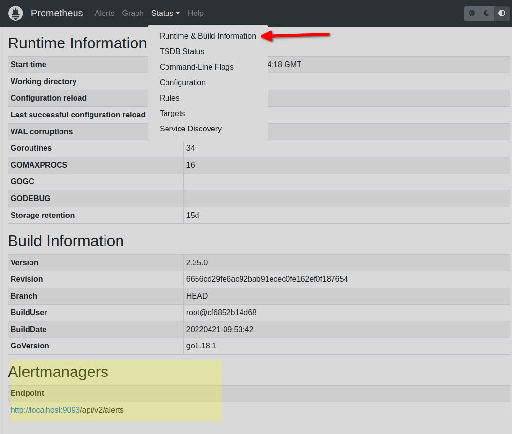
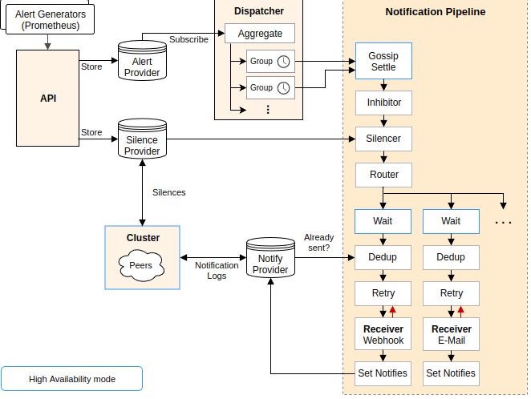
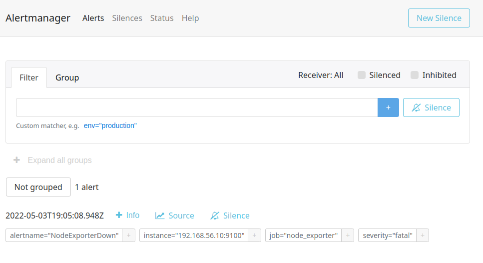
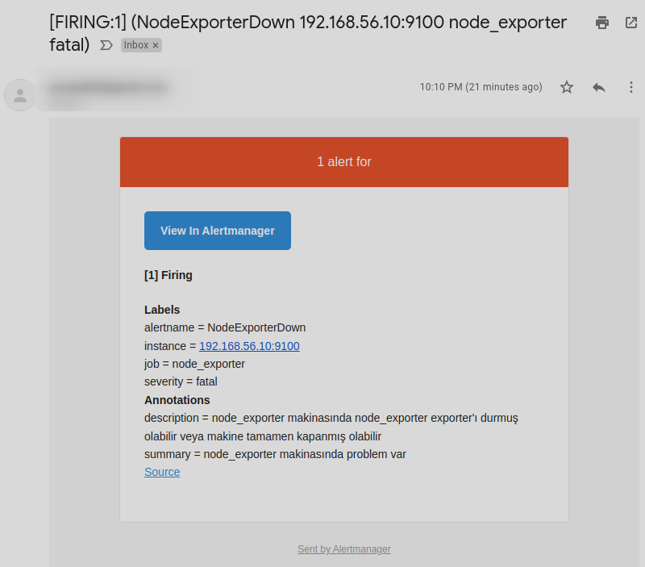

# Prometheus Alertmanager Kurulumu ve Notification (Prometheus Öğreniyoruz 5)


Yazının diğer makaleleri için alttaki linkleri kullanabilirsiniz.
- [Prometheus'a Giriş](1.prometheus-nedir.md)
- [Prometheus Instrumentation ve Node Exporter Kullanımı](2.instrumentation.md)
- [PromQL Kullanımı](3.quering.md)
- [Prometheus Kural Tanımlama](4.configuring_rules.md)
- [Prometheus Alertmanager Kullanımı](5.alertmanager.md)
- [Prometheus Blackbox Exporter Kullanımı](6.blackbox_exporter.md)
- [Prometheus Pushgateway Exporter Kullanımı](7.pushgateway.md)
- [Prometheus Service Discovery](8.service_discovery.md)
- [Prometheus Grafana Entegrasyonu](9.grafana_integration.md)

[Alertmanager](https://github.com/prometheus/alertmanager) da aynı Prometheus gibi ayrı bir araç ve kurup çalıştırılması gerekiyor. Yazıyı hazırladığım zaman en son 0.24.0 versiyonu yayınlanmıştı. [Resmi sayfasından](https://prometheus.io/download/#alertmanager) işletim sistemimiz için uygun olan dosyayı indiriyoruz extract ediyoruz.

Dosyaları çıkarttıktan sonra doğrudan Alertmanager dosyasını çalıştırmamız yeterli olacaktır.

Alttaki komut ile Linux üzerinde Docker ile kurulumunuzu yapabilirsiniz.

```shell

docker volume create alermanagerfiles

docker run -d -p 9093:9093  -v alermanagerfiles:/etc/alertmanager  prom/alertmanager:v0.24.0
```
Kurulum dizininde alertmanager.yml adında bir dosya olmalı. Eğer Docker ile devam ediyorsanız alttaki komutla bu doyanın bulunduğu dizin öğrenebilirsiniz. Aşağıda kendi bilgisayarım için oluşturulan path'i görüyorsunuz. __/var/lib/docker/volumes/alermanagerfiles/_data__ dizinindeki alertmanager.yml dosyasına ulaşabilirsiniz.

```shell

# sonuç
docker volume inspect alermanagerfiles
[
    {
        "CreatedAt": "2022-05-02T22:02:13+03:00",
        "Driver": "local",
        "Labels": {},
        "Mountpoint": "/var/lib/docker/volumes/alermanagerfiles/_data",
        "Name": "alermanagerfiles",
        "Options": {},
        "Scope": "local"
    }
]
```

alertmanager.yml dosyası

```yml
route:
  group_by: ['alertname']
  group_wait: 30s
  group_interval: 5m
  repeat_interval: 1h
  receiver: 'web.hook'
receivers:
  - name: 'web.hook'
    webhook_configs:
      - url: 'http://127.0.0.1:5001/'
inhibit_rules:
  - source_match:
      severity: 'critical'
    target_match:
      severity: 'warning'
    equal: ['alertname', 'dev', 'instance']
```
Şimdi alertmanager'ı Prometheus'a tanıtalım.

Prometeheus.yml dosyamızı açıyoruz ve alttaki düzenlemeyi yapıyoruz.


```yml
... kıdaltıldı
# Alertmanager configuration
alerting:
  alertmanagers:
    - static_configs:
        - targets:
            - localhost:9093


...kısaltıldı
```
daha sonra prometheus.yml dosyamızı refresh ediyoruz yani tekrar yüklüyoruz.

- Eğer Prometheus'u çalıştırmak için Docker kullanmadıysanız _http://localhost:9090/-/reload_ adresine POST veya PUT çağrısı yapmamız gerekiyor. POST çağrısı için curl komutunu bütün işletim sistemlerinde kullanabiliriz. Ancak bu POST çağrısını Prometheus'a yaptığımızda konfigürasyonun refresh olabilmesi için _Lifecycle API_'sini enable etmemiz gerekiyor. Bunun için de Prometheus'u terminalden çalıştırırken _--web.enable-lifecycle_ parametresini eklemek gerekiyor. Daha sonra alttaki komutla refresh edebilirsiniz her değişikliğinizde.

```
curl -X POST http://localhost:9090/-/reload
```

- Eğer Prometheus'u benim gibi Docker kullanarak çalıştırdıysanız o zaman alttaki komutla Prometheus'u restart etmeden konfigürasyonunuzu refresh edebilirsiniz.

```
docker exec <docker_container_id> killall -HUP prometheus
```


Artık tarayıcımızdan kontrol edebiliriz.




Alertmanager ile ilgili tüm konfigürasyon ayaları için [resmi sayfasını](https://prometheus.io/docs/alerting/latest/configuration/#:~:text=Alertmanager%20can%20reload%20its%20configuration,to%20the%20%2F%2D%2Freload%20endpoint.) ziyaret ediniz.

Alertmanager mimari yapısı




Yapılacak alert konfigürasyonlarında Go dilinin template sistemi kullanılabilir. Gönderilecek mesajlarda bazı bilgileri sistemden almak isteyebiliriz veya environment variable tanımlayarak bunları mesaj içinde göndermek isteyebiliriz.

- https://pkg.go.dev/text/template
- https://prometheus.io/docs/prometheus/latest/configuration/template_reference/
- https://prometheus.io/docs/alerting/latest/notifications/
- https://prometheus.io/docs/prometheus/latest/configuration/template_examples/


Ayrıca bazı durumlarda alert'leri durdurmak isteyebiliriz. Örneğin aynı konu ile ilgili türettiğimiz alert'lerden bazıları warning bazıları da critical olsun eğer critical bir alert zaten firing durumundaysa warning alert'leri durdurmak isteyebiliriz. Bu kavrama Lertmanager'da [inhibit_rule](https://prometheus.io/docs/alerting/latest/configuration/#inhibit_rule) diyoruz.

Diğer bir durumda notification'ları tamamen durdurmaktır. Örneğin sistemde bakım yapıyoruz diyelim bu durumda bir çok servis çalışmaz duruma gelecektir dolayısıyla bir çok alert oluşacaktır. Bu gibi durumlar sistemi sessiz (Silence) hale getirmek isteyebiliriz. Bunun  için Alertmanager arayüzünde zaten bir kullanım sunmaktadır. Herhangi bir alert isteğimiz zama sessiz hale getirebiliriz. Diğer bir kullanımda alert kuralı yazarken bazı kontroller yazarak belirli durumlarda notification'ın  oluşmasını engelleyebiliriz. Bu durmuada Alermanager'da [Sliences](https://prometheus.io/docs/alerting/latest/alertmanager/#silences) denir.

Örneğin yukarıda yazmış olduğumuz alert kuralını zamana bağlayabiliriz. İlgili alert sadece gece 11'den önce oluşacaktır.

```
up{job="node_exporter"} == 0 and on on() hour() 23
```


## Notification Örnekleri

Oluşan alert'lerin notification'a dönüştürülmesi ve ilgili sistemleri gönderilmesini Alertmanager tarafında yapılmaktadır. Alertmanager ilk kurulumla smtp, slack, telegram vb çok bilinen sistemlerle entegre olabilmektedir. Biz Bu yazımızda Gmail ile notification örneğini yapıyor olacağız. Diğer sitemler için de gerekli kaynakları verip bu kısmı bitirmek istiyoruz çünkü daha çok konumuz var. 


Aşağıdakiler dışında community'nin geliştirmiş olduğu bazı webhook receviver'ların listesini [şu sayfada](https://prometheus.io/docs/operating/integrations/#alertmanager-webhook-receiver) bulabilirsiniz.


## Gmail ile Notification

Gmail üzerinde mail gönderebilmek için öncelikle alttaki ki URL tarayıcıda açıp gerekli izinleri vermeniz grekiyor.
- https://myaccount.google.com/lesssecureapps
- https://www.google.com/accounts/DisplayUnlockCaptcha 


Daha sonra alertmanager.yml dosyamızın içini tamamen temizleyip alttaki kodları kopyalıyoruz. Mail adreslerini ve şifreyi kendi ayarlarınızla değiştiriniz.

```yml

global:
  resolve_timeout: 1m

route:
  group_by: ["mail_alert_group"]
  receiver: email_router

receivers:
- name: email_router
  email_configs:
  - to: 'to_mail@gmail.com'
    from: 'from_mail@gmail.com'
    smarthost: 'smtp.gmail.com:587'
    auth_username: 'from_mail'
    auth_identity: 'from_mail'
    auth_password: 'p@ssword'

```


[Kaynak 1](https://prometheus.io/docs/alerting/latest/notification_examples/), [Kaynak 2](https://www.robustperception.io/sending-email-with-the-alertmanager-via-gmail), [Kaynak 3](https://stackoverflow.com/questions/35637533/how-do-i-tell-prometheus-alertmanager-to-send-email-through-gmails-smtp-server), [Kaynak 4](https://www.robustperception.io/using-labels-to-direct-email-notifications)


Daha sonra alertmanager.yml dosyamızı tekrar yüklememiz lazım bunun için Prometheus'da da yaptığımız yöntemi kullanacağız. Ancak öncelikle yaptığımız konfigürasyonun doğrulunu check edelim.

```sh
amtool check-config alertmanager.yml

# sonuç

# Checking 'alertmanager.yml'  SUCCESS
# Found:
#  - global config
#  - route
#  - 0 inhibit rules
#  - 1 receivers
#  - 0 templates


```
Artık tekrar yükleme yapabiliriz.


- Eğer Alertmanager'ı çalıştırmak için Docker kullanmadıysanız _http://localhost:9093/-/reload_ adresine POST veya PUT çağrısı yapmamız gerekiyor. POST çağrısı için curl komutunu bütün işletim sistemlerinde kullanabiliriz.Alttaki komutla refresh edebilirsiniz her değişikliğinizde.

```
curl -X POST http://localhost:9090/-/reload
```

- Eğer Alertmanager'ı benim gibi Docker kullanarak çalıştırdıysanız o zaman alttaki komutla Alertmanager'ı restart etmeden konfigürasyonunuzu refresh edebilirsiniz.

```
docker exec <docker_container_id> killall -HUP alertmanager
```
Node_exporter için yazdığımız alert kuralını tetiklemek için sanal makinamızda çalışan node_exporter'ı stop ediyoruz.

30 saniye sonra Alertmanager üzerinde alttaki alert'i görüyor olacağız.



Mailimiz kontrol edecek olursak alert'in geldiğini görebiliriz.




## Slack ile Notification
Slack entegrasyonu için alttaki kaynaklardan faydalanabilirsiniz.


- https://prometheus.io/docs/alerting/latest/configuration/#slack_config
- https://prometheus.io/docs/alerting/latest/notification_examples/
- https://ivanahuckova.medium.com/step-by-step-guide-to-setting-up-prometheus-alertmanager-with-slack-pagerduty-and-gmail-75069a8905b7
- https://api.slack.com/messaging/webhooks


## Telegram ile Notification


- https://prometheus.io/docs/alerting/latest/configuration/#telegram_config
- https://muetsch.io/sending-prometheus-alerts-to-telegram-with-telepush.html
- https://tienbm90.medium.com/prometheus-alertmanager-send-alerts-to-admin-via-telegram-81b4f547089f
  

## MS Teams ile Notification

Alertmanager resmi olarak MS Teams'i desteklememektedir. Bunun için community'nin geliştirdiği açık kaynak iki tane sistem var bunları kullanabilirsiniz.

- https://github.com/prometheus-msteams/prometheus-msteams
- https://github.com/idealista/prom2teams

## SMS ile Notification

Bunun için kullanılabilecek en iyi yöntem web_hook konfigürasyonu yapmak. SMS provider'ınızın size vermiş olduğu API endpoint'inin bu konfigürasyonla sisteme tanıtmanız olacaktır. Eğer kendilerinin sunduğu bir sistem varsa entegrasyon için ınu da kullanabilirsiniz.

- https://prometheus.io/docs/alerting/latest/configuration/#webhook_config

Yada hali hazırda Alertmanager entegrasyonu sunan uluslararası bazı SMS sistemlerini kullanabilirsiniz. Bunlardan bazıları sadece SMS değil Email, Whatsapp, Telegram, MS Teams gibi diğer sistemleri  destekleyebiliyor.

- [PagerTree](https://github.com/PagerTree/prometheus-grafana-alertmanager-example)
- [PagerDuty](https://www.pagerduty.com/docs/guides/prometheus-integration-guide/)


Yazının diğer makaleleri için alttaki linkleri kullanabilirsiniz.
- [Prometheus'a Giriş](1.prometheus-nedir.md)
- [Prometheus Instrumentation ve Node Exporter Kullanımı](2.instrumentation.md)
- [PromQL Kullanımı](3.quering.md)
- [Prometheus Kural Tanımlama](4.configuring_rules.md)
- [Prometheus Alertmanager Kullanımı](5.alertmanager.md)
- [Prometheus Blackbox Exporter Kullanımı](6.blackbox_exporter.md)
- [Prometheus Pushgateway Exporter Kullanımı](7.pushgateway.md)
- [Prometheus Service Discovery](8.service_discovery.md)
- [Prometheus Grafana Entegrasyonu](9.grafana_integration.md)