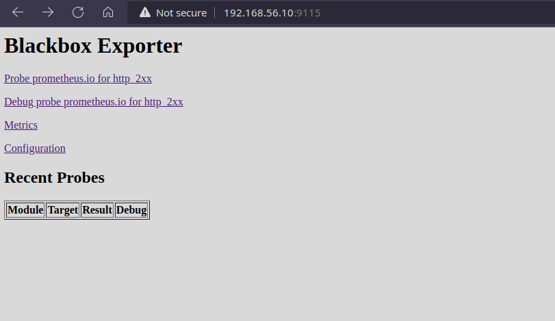
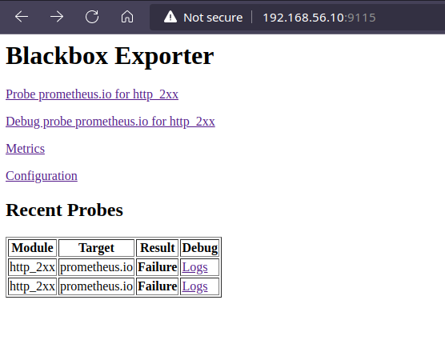
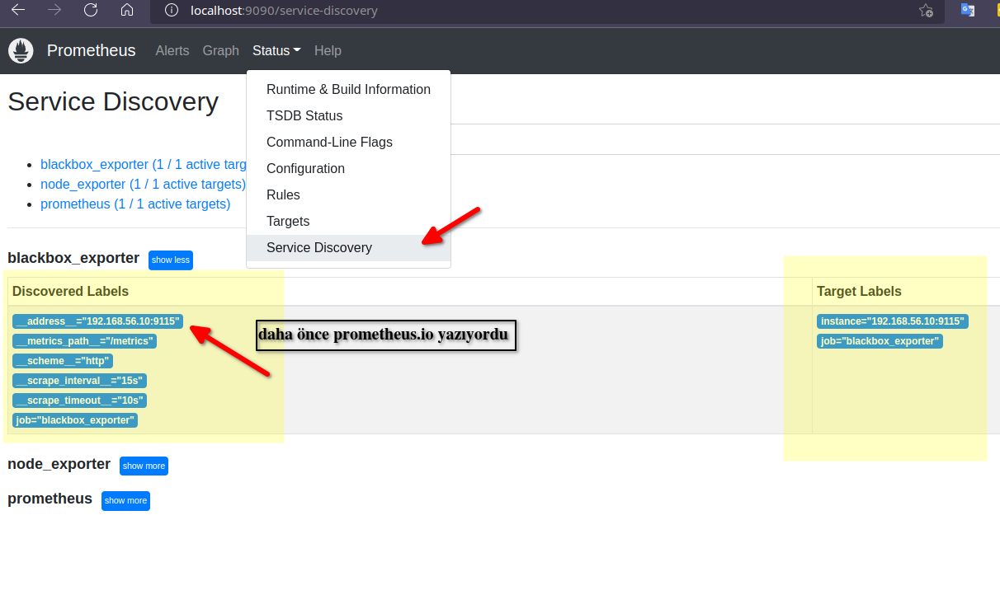
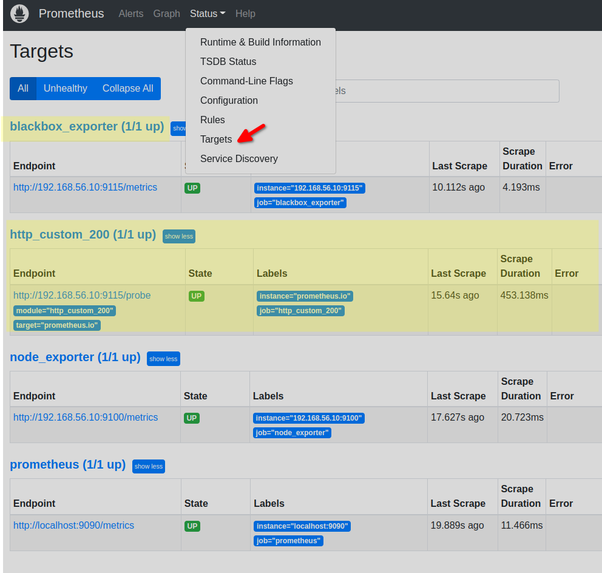
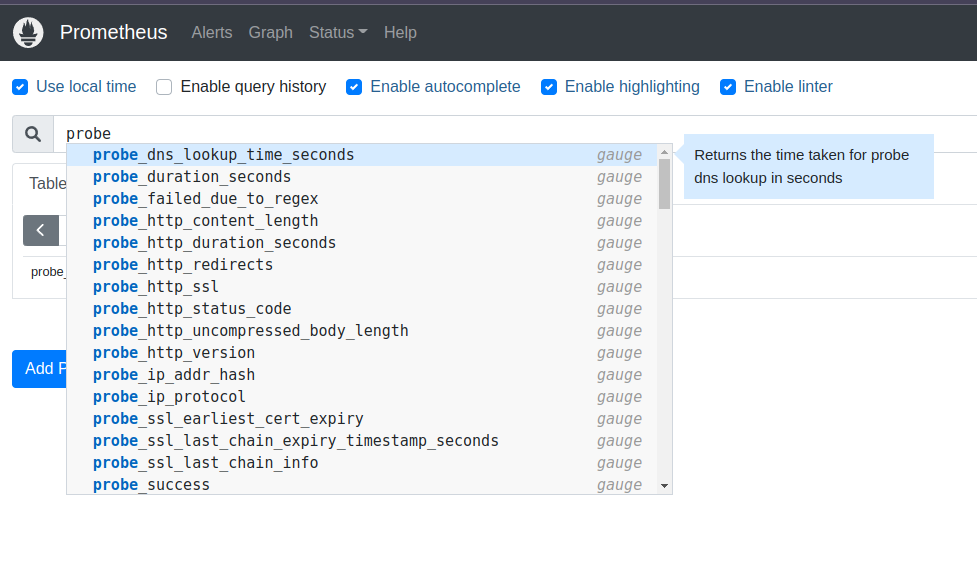

# Prometheus Blackbox Exporter Kullanımı (Prometheus Öğreniyoruz 6)

Yazının diğer makaleleri için alttaki linkleri kullanabilirsiniz.
- [Prometheus'a Giriş](1.prometheus-nedir.md)
- [Prometheus Instrumentation ve Node Exporter Kullanımı](2.instrumentation.md)
- [PromQL Kullanımı](3.quering.md)
- [Prometheus Kural Tanımlama](4.configuring_rules.md)
- [Prometheus Alertmanager Kullanımı](5.alertmanager.md)
- [Prometheus Blackbox Exporter Kullanımı](6.blackbox_exporter.md)
- [Prometheus Pushgateway Exporter Kullanımı](7.pushgateway.md)
- [Prometheus Service Discovery](8.service_discovery.md)
- [Prometheus Grafana Entegrasyonu](9.grafana_integration.md)

[Blackbox Exporter](https://github.com/prometheus/blackbox_exporter) alert almayı istediğimiz sistemlerin içine müdahil olamadığımız durumlara kullanılan bir exporter'dır. Herzaman her sistemin içine entegre olamayabiliriz bu bazen mümkün değildir bazen de gereksiz olabilir. Exporter HTTP, HTTPS, DNS, ICMP VE TCP  protokolleri üzerinden haberleşmektedir.


[resim kaynak](https://ebookreading.net/view/book/EB9781789612349_152.html)

Bu exporter iki adet endpoint kullanır.

- **/metrics**: Target sistemin metriklerine ulaşmak için kullanılır.
- **/probe**:  Blackbox için query'leri için endpoint'dir. Sonuçları Prometheus'un anlayacağı formatta geri döndürür.

Probe kavramı network dünyasında bir sistemin ayakta olup olmadığını kontrol etmek anlamında kullanılan bir terimdir. İngilizceden tercümesi de incelemek ve bulmak gibi anlamlara gelir.  


Bunu da aynı node_exporter gibi sayfasından indirip çalıştırıyoruz. Zaten daha önce bir sanal makina ayağa kaldırmıştık aynı node_exporter gibi bunu da orada indirip çalıştıracağız.

Şu linkten bütün işletim sistemleri için exporter'ı indirebilirsiniz.

Sanl makinemizde çalıştırmak için alttaki adımları m

```shell
wget https://github.com/prometheus/blackbox_exporter/releases/download/v0.20.0/blackbox_exporter-0.20.0.linux-amd64.tar.gz

tar -xf blackbox_exporter-0.20.0.linux-amd64.tar.gz

cd blackbox_exporter-0.20.0.linux-amd64

./blackbox_exporter

```

Tarayıcıda _http://192.168.56.10:9115/_ adresini açtığımızda alttaki gibi bir ekran karşılıyor olacak.

Alttaki linkler örnek konfigürasyon dosyasında Prometheus anasayfası için tanımlı ayarlara göre oluşan metrikler için eklenmiş. Biz kendi http probe' umuzu oluşturup ilgili linki buna göre değiştirerek sonuçlarımı göreceğiz.




Exporter tam olarak çalışmaya başladıktan sonra alttaki gibi iki adet probe eklenmiş olacak.



Blackbox.yml dosyasını kullanarak yukarıda bahsettiğimiz protokoller üzerinden sistemleri monitör edebiliriz. Dosyanın konfigürasyonu için [şu linkten](https://github.com/prometheus/blackbox_exporter/blob/master/CONFIGURATION.md) faydalanabilirsiniz.


Dosyauı incelediğimizde bir çok modülün hali hazırda ayarlı olduğunu görebiliriz

```yml
modules:
  http_2xx:
    prober: http
  http_post_2xx:
    prober: http
    http:
      method: POST
  tcp_connect:
    prober: tcp
  pop3s_banner:
    prober: tcp
    tcp:
      query_response:
      - expect: "^+OK"
      tls: true
      tls_config:
        insecure_skip_verify: false
  grpc:
    prober: grpc
    grpc:
      tls: true
      preferred_ip_protocol: "ip4"
  grpc_plain:
    prober: grpc
    grpc:
      tls: false
      service: "service1"
  ssh_banner:
    prober: tcp
    tcp:
      query_response:
      - expect: "^SSH-2.0-"
      - send: "SSH-2.0-blackbox-ssh-check"
  irc_banner:
    prober: tcp
    tcp:
      query_response:
      - send: "NICK prober"
      - send: "USER prober prober prober :prober"
      - expect: "PING :([^ ]+)"
        send: "PONG ${1}"
      - expect: "^:[^ ]+ 001"
  icmp:
    prober: icmp

```

Biz de kendi http konfigürasyonumuzu yapalım isterseniz.

modules altına alttaki bloğu ekleyelim.


```yml
modules:

  http_custom_200:
    prober: http
    http:
      preferred_ip_protocol: ip4
      follow_redirects: true
      fail_if_body_not_matches_regexp:
        - "Download"


  http_2xx:
    prober: http
  http_post_2xx:
    prober: http
    http:
      method: POST
  tcp_connect:
    prober: tcp
  pop3s_banner:

#... kısaltıldı

```

Daha sonra blackbox_exporter'ı tekrar başlatıyoruz.

Tarayıcımızda http://192.168.56.10:9115/probe?target=prometheus.io&module=http_custom_200&debug=true adresini açıyoruz.

Adreste prometheus.io dışında herhangi bir domaini yazabiliriz. Ancak tabii ki konfigürasyonda yazılı olan kuralların çalışacağını unutmamalıyız. Adresin debug modda açıldığına dikkat edin. Alttaki gibi iki bölümden oluşan bir mesaj alıyor olacağız. İlk kısım yapılan kontrolün sonucu ikinci bölümde de Prometheus'u ilgilendiren kısmı görebiliriz.

Sonucun success olduğu _msg="Probe succeeded"_ kısmından anlıyoruz. İlk kısmın sonların doğru görebilirsiniz.


```
Logs for the probe:
ts=2022-05-04T18:53:53.401818285Z caller=main.go:347 module=http_google_200 target=prometheus.io level=info msg="Beginning probe" probe=http timeout_seconds=119.5
ts=2022-05-04T18:53:53.402122265Z caller=http.go:334 module=http_google_200 target=prometheus.io level=info msg="Resolving target address" target=prometheus.io ip_protocol=ip4
ts=2022-05-04T18:53:53.56089116Z caller=http.go:334 module=http_google_200 target=prometheus.io level=info msg="Resolved target address" target=prometheus.io ip=172.67.201.240
ts=2022-05-04T18:53:53.560983183Z caller=client.go:252 module=http_google_200 target=prometheus.io level=info msg="Making HTTP request" url=http://172.67.201.240 host=prometheus.io
ts=2022-05-04T18:53:53.705669208Z caller=client.go:498 module=http_google_200 target=prometheus.io level=info msg="Received redirect" location=https://prometheus.io/
ts=2022-05-04T18:53:53.705847042Z caller=client.go:252 module=http_google_200 target=prometheus.io level=info msg="Making HTTP request" url=https://prometheus.io/ host=
ts=2022-05-04T18:53:53.705855929Z caller=client.go:252 module=http_google_200 target=prometheus.io level=info msg="Address does not match first address, not sending TLS ServerName" first=172.67.201.240 address=prometheus.io
ts=2022-05-04T18:53:54.276915359Z caller=main.go:140 module=http_google_200 target=prometheus.io level=info msg="Received HTTP response" status_code=200
ts=2022-05-04T18:53:54.278574461Z caller=main.go:140 module=http_google_200 target=prometheus.io level=info msg="Response timings for roundtrip" roundtrip=0 start=2022-05-04T21:53:53.561050179+03:00 dnsDone=2022-05-04T21:53:53.561050179+03:00 connectDone=2022-05-04T21:53:53.628714602+03:00 gotConn=2022-05-04T21:53:53.628759016+03:00 responseStart=2022-05-04T21:53:53.705613153+03:00 tlsStart=0001-01-01T00:00:00Z tlsDone=0001-01-01T00:00:00Z end=0001-01-01T00:00:00Z
ts=2022-05-04T18:53:54.278613424Z caller=main.go:140 module=http_google_200 target=prometheus.io level=info msg="Response timings for roundtrip" roundtrip=1 start=2022-05-04T21:53:53.705951658+03:00 dnsDone=2022-05-04T21:53:53.706480961+03:00 connectDone=2022-05-04T21:53:53.769908268+03:00 gotConn=2022-05-04T21:53:53.880610423+03:00 responseStart=2022-05-04T21:53:54.276886174+03:00 tlsStart=2022-05-04T21:53:53.770002265+03:00 tlsDone=2022-05-04T21:53:53.879887246+03:00 end=2022-05-04T21:53:54.278563931+03:00
ts=2022-05-04T18:53:54.278672244Z caller=main.go:347 module=http_google_200 target=prometheus.io level=info msg="Probe succeeded" duration_seconds=0.876789017


Metrics that would have been returned:
# HELP probe_dns_lookup_time_seconds Returns the time taken for probe dns lookup in seconds
# TYPE probe_dns_lookup_time_seconds gauge
probe_dns_lookup_time_seconds 0.158774186
# HELP probe_duration_seconds Returns how long the probe took to complete in seconds
# TYPE probe_duration_seconds gauge
probe_duration_seconds 0.876789017
# HELP probe_failed_due_to_regex Indicates if probe failed due to regex
# TYPE probe_failed_due_to_regex gauge
probe_failed_due_to_regex 0
# HELP probe_http_content_length Length of http content response
# TYPE probe_http_content_length gauge

----------------------------- KISALTILDI

```


Diğer modüller için konfigürasyon örneklerini [resmi dokümanlarında](https://github.com/prometheus/blackbox_exporter/blob/master/CONFIGURATION.md) bulabilirsiniz.


Artık exporter'ımızı Prometheus'a tanıtabiliriz. Bunun için Prometheus.yml dosyamızı açıp yeni bir job tanımlarımızı yapıyoruz. 


```yml

# ------------- kısaltıldı

scrape_configs:
  # The job name is added as a label `job=<job_name>` to any timeseries scraped from this config.
  - job_name: "prometheus"

    # metrics_path defaults to '/metrics'
    # scheme defaults to 'http'.

    static_configs:
      - targets: ["localhost:9090"]

  - job_name: "node_exporter"
    static_configs:
      - targets: ["192.168.56.10:9100"]
        
  - job_name: "node_exporter"
    static_configs:
      - targets: ["192.168.56.10:9100"]

# buradan sonrası yeni eklendi
  - job_name: "blackbox_exporter"
    static_configs:
      - targets: ["192.168.56.10:9115"]

  - job_name: "http_custom_200"
    static_configs:
      - targets:
        - "prometheus.io" # test edilecek domain adı/adları yazılır
    metrics_path: "/probe"
    params:
      module:
      - http_custom_200 # yazdığımız module adı

    relabel_configs:
      - source_labels: [__address__]
        target_label: __param_target
      - source_labels: [__param_target]
        target_label: instance
      - target_label: __address__
        replacement: 192.168.56.10:9115  # bloackbox'ın gerçek adresi
```

Relabling Promethes'un güçlü araçlarında biridir. Konu ile alakalı detaylı bir makaleyi [şu adresten](https://valyala.medium.com/how-to-use-relabeling-in-prometheus-and-victoriametrics-8b90fc22c4b2) okuyabilirsiniz. Basitçe sistemde tanımlı lable'ları değiştirmek, silmek, yenilerini eklemek veya bazı gereksiz metrikleri kaldırmak (drop) vb. ilermler için kullanılabilir.

Burada kullanma sebebimiz ise target kısmında _promethesu.io_ dediğimizde Prometheus'un aynı zamanda blackbox target adresi olarak da bu adresi kullanmaya çalışıyor olması. Bunu değiştirmek için de [relabeling](https://github.com/prometheus/blackbox_exporter#prometheus-configuration) uyguluyoruz. 

Konfigürasyonda geçen bilgilere de _Service Discovery_ menüsünden ulaşabilirsiniz.




Prometheus yönetim panelinde Status menüsü altındaki targets'a tıkladığımızda alttaki gibi bir sayfa göreceğiz. Blackbox exporter'un up durumunda olduğu görülebilir.





Görüleceği üzere blockbox exporter'a eklediğimiz modül ile sanki Prometheus'a farklı bir exporter eklemişiz gibi bir web sitesini probe edebiliyoruz.

Ayrıca expression olarak artık probe'u  da kullanabiliyoruz. Örneğin _probe_success_ komutu ile _prometheus.io_ sitemizin 200 success dönüp dönmediğini kontrol edebiliriz.



Bu örneğimizde http probe nasıl yapılır onu gördük ancak bunun haricinde HTTP, HTTPS, DNS, ICMP, gRPC VE TCP gibi protokoller üzerinden metrik toplamak mümkün.

Bunun için [şu referans dokümanını](https://github.com/prometheus/blackbox_exporter/blob/master/CONFIGURATION.md) kullanabilirsiniz.


Umarım faydalı olmuştur.


Yazının diğer makaleleri için alttaki linkleri kullanabilirsiniz.
- [Prometheus'a Giriş](1.prometheus-nedir.md)
- [Prometheus Instrumentation ve Node Exporter Kullanımı](2.instrumentation.md)
- [PromQL Kullanımı](3.quering.md)
- [Prometheus Kural Tanımlama](4.configuring_rules.md)
- [Prometheus Alertmanager Kullanımı](5.alertmanager.md)
- [Prometheus Blackbox Exporter Kullanımı](6.blackbox_exporter.md)
- [Prometheus Pushgateway Exporter Kullanımı](7.pushgateway.md)
- [Prometheus Service Discovery](8.service_discovery.md)
- [Prometheus Grafana Entegrasyonu](9.grafana_integration.md)