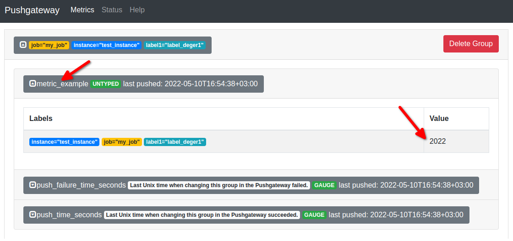

# Prorometheus ile Pushgateway Exporter Kullanımı (Prometheus Öğreniyoruz 7)

Yazının diğer makaleleri için alttaki linkleri kullanabilirsiniz.
- [Prometheus'a Giriş](1.prometheus-nedir.md)
- [Prometheus Instrumentation ve Node Exporter Kullanımı](2.instrumentation.md)
- [PromQL Kullanımı](3.quering.md)
- [Prometheus Kural Tanımlama](4.configuring_rules.md)
- [Prometheus Alertmanager Kullanımı](5.alertmanager.md)
- [Prometheus Blackbox Exporter Kullanımı](6.blackbox_exporter.md)
- [Prometheus Pushgateway Exporter Kullanımı](7.pushgateway.md)
- [Prometheus Service Discovery](8.service_discovery.md)
- [Prometheus Grafana Entegrasyonu](9.grafana_integration.md)


Merhaba arkadaşlar

Bu yazımızda Prometheus'un pushgateway exporter'ını inceleyeceğiz. 


Öncelikle nedir ne değildir mimari kurgusu üzerinden anlamaya çalışalım.


[resim kaynak](https://prometheus.io/docs/introduction/overview/)

**pushgateways**: bazı metrikler pull metodu ile toplanmaya elverişli olmayabilir. Bu gibi durumlarda bu metod kullanılır. Pull yapılabilen ara katman olarak çalışır.


Biraz daha açacak olursak bazen target tarafında yapılabilecek bir şey yoktur  yani custom exporter yazılamayabilir, bir kütüphane bulunabilir veya bunları kullanmak pushgateway kullanmaktan daha zaman alıcı olabilir. Bu ve benzeri durumlardan dolayı target tarafından metrikleri pushgetway'e push'layıp Prometheus'un pushgateway üzerinden pull yapması sağlanabilir.

Pushgateway'i sanal makinamıza kurup çalıştıralım. Windows versiyonunu [Download](https://prometheus.io/download/#pushgateway) sayfaından indirebilirsiniz.

```shell

wget https://github.com/prometheus/pushgateway/releases/download/v1.4.2/pushgateway-1.4.2.linux-amd64.tar.gz

tar -xf pushgateway-1.4.2.linux-amd64.tar.gz

cd pushgateway-1.4.2.linux-amd64

./pushgateway

```

Bu exporter da 9091 portundan yayın yapıyor. Sayfayı _http://192.168.56.10:9091/_ adresinden çağıracak olursak boş bir sayfayla karşılaşacağız.

Şimdi bu exporter'ı da Prometheus'a girelim. 

Prometheus.yml dosyasında alttaki düzenlemeyi yapıyoruz.


```shell
#-------------------kısaltıldı

scrape_configs:
  - job_name: "prometheus"
    static_configs:
      - targets: ["localhost:9090"]

#--------------------- yeni exporter eklendi
  - job_name: "pushgateway"
    static_configs:
      - targets: ["192.168.56.10:9091"]  

#-------------------kısaltıldı
```
- Eğer Prometheus'u çalıştırmak için Docker kullanmadıysanız _http://localhost:9090/-/reload_ adresine POST veya PUT çağrısı yapmamız gerekiyor. POST çağrısı için curl komutunu bütün işletim sistemlerinde kullanabiliriz. Ancak bu POST çağrısını Prometheus'a yaptığımızda konfigürasyonun refresh olabilmesi için _Lifecycle API_'sini enable etmemiz gerekiyor. Bunun için de Prometheus'u terminalden çalıştırırken _--web.enable-lifecycle_ parametresini eklemek gerekiyor. Daha sonra alttaki komutla refresh edebilirsiniz her değişikliğinizde.

```
curl -X POST http://localhost:9090/-/reload
```

- Eğer Prometheus'u benim gibi Docker kullanarak çalıştırdıysanız o zaman alttaki komutla Prometheus'u restart etmeden konfigürasyonunuzu refresh edebilirsiniz.

```
docker exec <docker_container_id> killall -HUP prometheus
```
- Eğer Docker kullanmadıysanız ve yukarıdaki sistemi kurmak da istemiyorsanız aşağıdaki komutu da kullanabilirsiniz

```
killall -HUP prometheus
```

Ayarlarımız tekrar yükledikten sonra aşağıdaki gibi kontrol edebiliriz.


Pushgateway API'sini kullanarak metriklerimizi gönderebiliriz. Dokümanları [şu linkten](https://github.com/prometheus/pushgateway/blob/master/README.md) de takip edebilirsiniz.

API'yi kullanmak için yapısını biraz incelememiz gerekiyor. Bir job tanımı ve bu job ile ilişkili instance label'lar ve bu label'lara ait değerleri API üzerinden göndermemiz gerekiyor.

Basitçe API endpoint şu şekilde kullanılır.

```
/metrics/job/<JOB_NAME>{/<LABEL_NAME>/<LABEL_VALUE>}
```

Basit bir metrik kaydı yapalım. Bunun için _curl_ komutunu kullanacapız. Bildiğim kadarıyla artık Windows 10 ve 11 de curl komutu geliyor ancak sorun yaşarsanız bütün işlerim sistemleri için [download](https://curl.se/download.html) sayfasını ziyaret edebilirsiniz.

Aşağıdaki komutu terminal, cmd veya powershell console ile çalıştırabilirsiniz.

```
echo "metric_example 2022" | curl --data-binary @- http://192.168.56.10:9091/metrics/job/my_job/instance/test_instance/label1/label_deger1
```

_http://192.168.56.10:9091/_ adresinden metrics menüsüne gidecek olursak metriğimizin kaydedildiğini görebiliriz. Ayrıca timestamp de kaydedilmiş.



Prometheus üzerinde de pushgateway üzerinden kaydettiğimiz metriği görebiliriz.


Yazının diğer makaleleri için alttaki linkleri kullanabilirsiniz.
- [Prometheus'a Giriş](1.prometheus-nedir.md)
- [Prometheus Instrumentation ve Node Exporter Kullanımı](2.instrumentation.md)
- [PromQL Kullanımı](3.quering.md)
- [Prometheus Kural Tanımlama](4.configuring_rules.md)
- [Prometheus Alertmanager Kullanımı](5.alertmanager.md)
- [Prometheus Blackbox Exporter Kullanımı](6.blackbox_exporter.md)
- [Prometheus Pushgateway Exporter Kullanımı](7.pushgateway.md)
- [Prometheus Service Discovery](8.service_discovery.md)
- [Prometheus Grafana Entegrasyonu](9.grafana_integration.md)