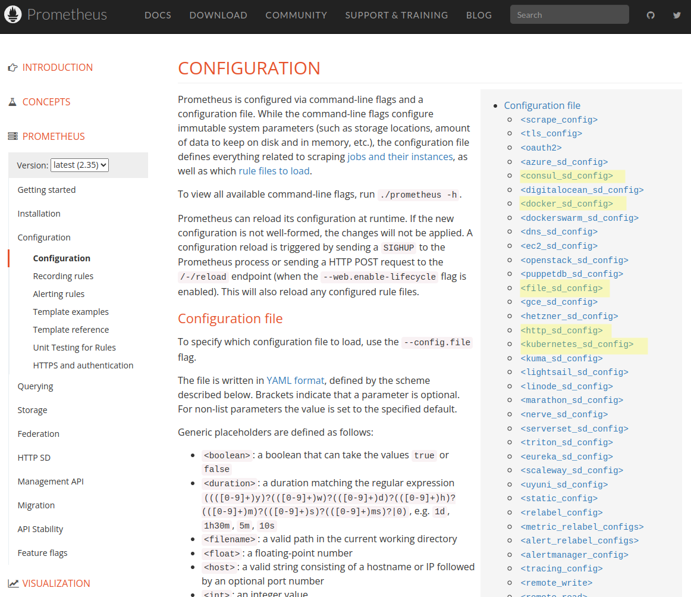

# Prometheus ile Service Discovery (Prometheus Öğreniyoruz 8)

Yazının diğer makaleleri için alttaki linkleri kullanabilirsiniz.
- [Prometheus'a Giriş](1.prometheus-nedir.md)
- [Prometheus Instrumentation ve Node Exporter Kullanımı](2.instrumentation.md)
- [PromQL Kullanımı](3.quering.md)
- [Prometheus Kural Tanımlama](4.configuring_rules.md)
- [Prometheus Alertmanager Kullanımı](5.alertmanager.md)
- [Prometheus Blackbox Exporter Kullanımı](6.blackbox_exporter.md)
- [Prometheus Pushgateway Exporter Kullanımı](7.pushgateway.md)
- [Prometheus Service Discovery](8.service_discovery.md)
- [Prometheus Grafana Entegrasyonu](9.grafana_integration.md)

Merhaba arkadaşlar

Bu yazımızda service discovery kavramını anlamaya çalışacağız.Şimdiye kadar  _prometheus.yml_ dosyasına tanımladığımız exporter'lar da aslında birer service tanımlaması. 


Öncelikle nedir ne değildir mimari kurgusu üzerinden anlamaya çalışalım. İlgili servisin (varsa) desteklenen service tanımlaması ile metrik toplamak mümkün olacaktır. 


[resim kaynak](https://prometheus.io/docs/introduction/overview/)


Prometheus [resmi konfigürasyon referans sayfasına](https://prometheus.io/docs/prometheus/latest/configuration/configuration/#configuration) bakacak olursak aşağıdaki gibi bir liste göreceğiz.



En çok kullanılanlardan bazılarını işaretledim. Birkaçını inceleyelim.


## Dosya Bazlı Service Discovery

Node exporter üzerinden örnek verecek olursak bütün makinelere node exporter kurduktan sonra makineleri Prometheus'a tanıtmak için  _scrape\_configs_ içine _[file\_sd\_config](https://prometheus.io/docs/prometheus/latest/configuration/configuration/#file_sd_config)_  tanımlaması yapmak yeterli.

Bunun için json veya yaml uzantılı dosya kullanılabilir.

Öncekile prometheus.yml dosyasına dosyamızı tanımlıyoruz.

```yml
scrape_configs:
- job_name: 'node'
  file_sd_configs:
  - files:
    - 'targets.json'
```

target.json dosyamızın içeriği aşağıdaki gibi olabilir.

```json
[
  {
    "targets": [ "sunucu1:9100", "sunucu2:9100", "sunucu3:9100" ],
    "labels": {
      "env": "prod_sunuculari",
      "job": "web_sunuculari"
    }
  }
]
```

Bu şekilde kullanmanın en büyük faydası da yeni eklediğimiz sunucular için sistemi restart etmek zorunda olamamız.


## Http Bazlı Service Discovery

Sadece json olarak tanımlanabilir. 


Öncekile prometheus.yml dosyasına json tipinde target'larımızı döndürecek url'i tanımlıyoruz.

```yml
scrape_configs:
- job_name: 'node'
  http_sd_configs:
  - url: http://localhost/http_sd_targets
    basic_auth:
        username: aaaa
        password: bbbb
```

URL aşağıdakine benzer bir json formatında veri döndürmelidir. Burada yapabileceklerimiz tabii ki bununla sınırlı değil. Eğer takip edeceğimiz http servisleri oauth2 standardı kullanarak hizmet veriyorsa bunu kurgulamak da mümkün. Proxy varsa eğer arada bunu ayarlamak da mümkün. Daha fazlası için [resmi dokümanları](https://prometheus.io/docs/prometheus/latest/configuration/configuration/#http_sd_config) inceleyebilirsiniz.

```json
[
    {
        "targets": ["10.0.10.2:9100", "10.0.10.3:9100", "10.0.10.4:9100", "10.0.10.5:9100"],
        "labels": {
            "__meta_datacenter": "london",
            "__meta_prometheus_job": "node"
        }
    },
    {
        "targets": ["10.0.40.2:9100", "10.0.40.3:9100"],
        "labels": {
            "__meta_datacenter": "london",
            "__meta_prometheus_job": "alertmanager"
        }
    },
    {
        "targets": ["10.0.40.2:9093", "10.0.40.3:9093"],
        "labels": {
            "__meta_datacenter": "newyork",
            "__meta_prometheus_job": "alertmanager"
        }
    }
]
```

## Kubernetes Service Discovery


Kubernetes için çok detaylı konfigürasyon seçenekleri Bulunuyor. Resmi doküman için [şu linke](https://prometheus.io/docs/prometheus/latest/configuration/configuration/#kubernetes_sd_config) bakınız.


Kubernetes Discovery Service ayarları ile sadece Kubernetes node'larını değil aynı zamanda  servisleri, pod'ları, ingress tanımlarını da monitör edebilirsiniz.

Ancak genellikle Prometheus Kubernetes için kullanılcaksa external bir Prometheus ayağa kaldırmaktansa community daha çok doğrudan Kubernetes içinden ayağa kaldırıp monitör etmeyi tercih ediyor. Bu şekilde kurulum yapmak isterseniz internette bir çok kaynak bulabilirsiniz. 


Umarım faydalı olmuştur.


Yazının diğer makaleleri için alttaki linkleri kullanabilirsiniz.
- [Prometheus'a Giriş](1.prometheus-nedir.md)
- [Prometheus Instrumentation ve Node Exporter Kullanımı](2.instrumentation.md)
- [PromQL Kullanımı](3.quering.md)
- [Prometheus Kural Tanımlama](4.configuring_rules.md)
- [Prometheus Alertmanager Kullanımı](5.alertmanager.md)
- [Prometheus Blackbox Exporter Kullanımı](6.blackbox_exporter.md)
- [Prometheus Pushgateway Exporter Kullanımı](7.pushgateway.md)
- [Prometheus Service Discovery](8.service_discovery.md)
- [Prometheus Grafana Entegrasyonu](9.grafana_integration.md)