# Prometheus Grafana Entegrasyonu (Prometheus Öğreniyoruz 9)

Yazının diğer makaleleri için alttaki linkleri kullanabilirsiniz.
- [Prometheus'a Giriş](1.prometheus-nedir.md)
- [Prometheus Instrumentation ve Node Exporter Kullanımı](2.instrumentation.md)
- [PromQL Kullanımı](3.quering.md)
- [Prometheus Kural Tanımlama](4.configuring_rules.md)
- [Prometheus Alertmanager Kullanımı](5.alertmanager.md)
- [Prometheus Blackbox Exporter Kullanımı](6.blackbox_exporter.md)
- [Prometheus Pushgateway Exporter Kullanımı](7.pushgateway.md)
- [Prometheus Service Discovery](8.service_discovery.md)
- [Prometheus Grafana Entegrasyonu](9.grafana_integration.md)

Merhaba arkadaşlar

Prometheus öğreniyoruz yazı serisinin son makalesinde Grafana ile Prometheus'u birbiriyle konuşturmaya çalışacağız.

Grafana ile ilgili bağımsız bir bir makale serisi hazırlamayı düşünüyorum ancak şimdilik Prometheus metriklerini Grafana üzerinde takip edecek kadar öğrenmeye çalışalım.

Grafana eksiksiz bir [observability](https://en.wikiversity.org/wiki/Software_Design/Observability) (gözlemlenebilirlik) çözümüdür. Grafana ile uygulama ve sistemlerimizi monitör edebilir, meteriklerini ve loglarını analiz edebiliriz. Verilerimizi görselleştirebilir ve alert'ler üretebiliriz. Neredeyse bütün veri kaynaklarından veri çekebilmektedir.

Tam bir çözüm olarak aslında Grafana birden fazla ürünü içinde barındırır. Prometheus ile çok sıkı ilişkisi vardır ve doğal entegrasyon desteği de vardır.

- **Loki**: Loglama mekanizmasıdır. Sadece basit anlamda log tutmanın ötesinde indeksleme, metadata atama gibi işlemleri de yapar.Ayrıca object storage'larda veri tutma gibi özellikleri de vardır.
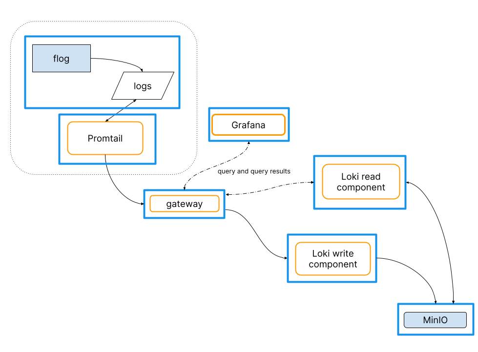
- **Tempo**: Yüksek hacimli tracing verilerini object storage kullanarak agent yardımıyla toplayıp Grafana'ya sunar.
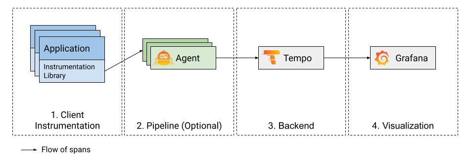
- **Mimir**: Prometheus  için yüksek performanslı, high available, multitanent bir storage çözümüdür.  

Konumuz Grafana'ya veri kaynağı olarak Prometheus'u göstermek olduğu için bu yazımızda bahsi geçen araçlarla ilgilenmeyeceğiz.

## Grafana Kurulum ve Entegrasyon

Grafana'yı hemen hemen bütün işletim sistemlerine kurabilirsiniz. Resmi download sayfasından istediğiniz yöntemle kurulumu yapabilirsiniz. Gerekli tüm bilgiler sayfasında verildiği için detyaylara girmeyeceğim. Kendim Docker versiyonunu kullancağım ancak siz istediğiniz işletim sistemini ve yöntemi tercih edebilirsiniz.

Resmi olarak Docker için sadece Linux versiyonu var.Alttaki komutla çalıştırabilirsiniz. Tabii ki Windows için de resmi olmayan image bulabilirsiniz. 

```
docker run --restart unless-stopped -d -p 3000:3000 grafana/grafana-oss:8.5.2-ubuntu

```
Daha sonra tarayıcıda _http://localhost:3000_ adresini çağıracak olursak sistem bize kullanıcı adı ve şifre soracak ardından değiştirmemizi isteyecektir. Kullanıcı adı ve şifre alanlarına _admin_ yazıp giriş yapabiliriz.

Prometheus'u data source olarka eklemek için alttaki gibi _Data Sources_ menüsünden _Add data source_ butonuna tıklıyoruz.

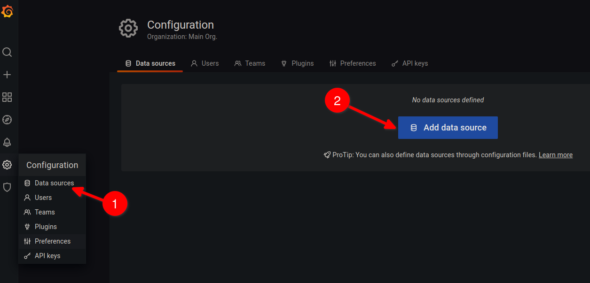

Ardından açılacak sayfada Prometheus'u seçiyoruz. URL kısmına _http://localhost:9090_ gerekli kalan bütün ayarları default değerleriyle bırakabiliriz. 

**UYARI**: Eğer Grafana Docker üzerinde çalıştıyorsanız haliyle localhost dediğinizde sistem Grafana konteyneri üzerinde arayacaktır bu nedenle Docker kullananlar URL kısmına Prometheus'un ip adresini yazmalıdır. Eğer Prometheus host makinanızda çalışıyorsa onun IP adresini, eğer Prometheus da Docker üzerinde çalışıyorsa onun IP adresini yazmalılar.  

_Save & Test_ butonuna tıklayıp hata yoksa Dashboards tabına tıklayıp listedeki üç dashboard'u da import ediyoruz. 


Daha sonra dashboards menüsünden browse'a tıklayıp ardından _Prometheus 2.0 Stats'a_ tıklıyoruz. 

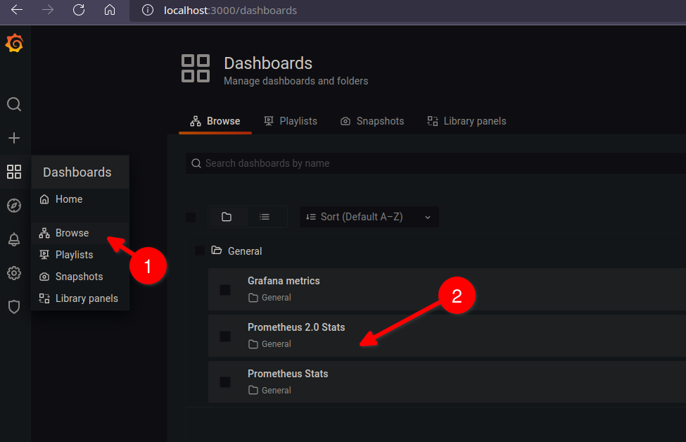

Açılan sayfada bizzat Prometheus'un kendisi ile ilgili metrikleri içeren dashboard'u görüyor olacağız. Dashboard aslında farklı eri kaynaklarını kullanarak oluşturulan görsellerin bulunduğu monitör sayfasıdır. Grafana kurulduğunda zaten import ettiğimiz dashboard'lar default olarak gelmiş oldu. Marketinde daha yüzlercesini bulmak mümkün. Ayrıca biz de kendimiz ihtiyaçlarımıza göre custom dashboard'lar oluşturabiliriz.

Ekrandaki bileşenlerden herhangi birini edit'leyecek olursak Prometheus query'lerini görebiliriz.

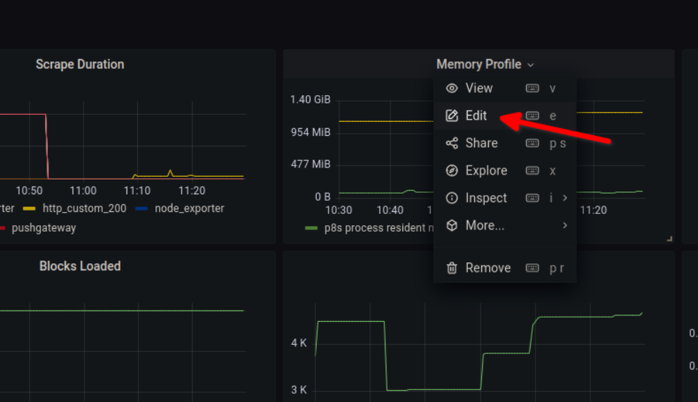

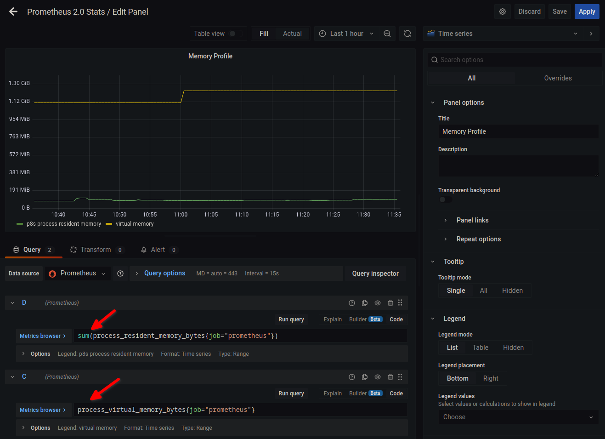

## Dashboard ve Plugin Yüklemek


Şimdide isterseniz Node_Export'umuzun kurulu olduğu sanal makinemizden Prometheus tarafından toplanan metriklere göre oluşturulmuş hazır bir dashboard'u Grafana web sayfasından indirip kullanalım. 

[Grafana Dashboard Download](https://grafana.com/grafana/dashboards) sayfasına gidip arama bölümüne node yazıp _Node Exporter Full_ yazan dashboard linkine tıklayalım. Bu dashboard Linux için hazırlanmış. Eğer Windows bir makinede node exporter'ı çalıştırıyorsanız arama bölümünde _windows_ yazıp aratınız. 

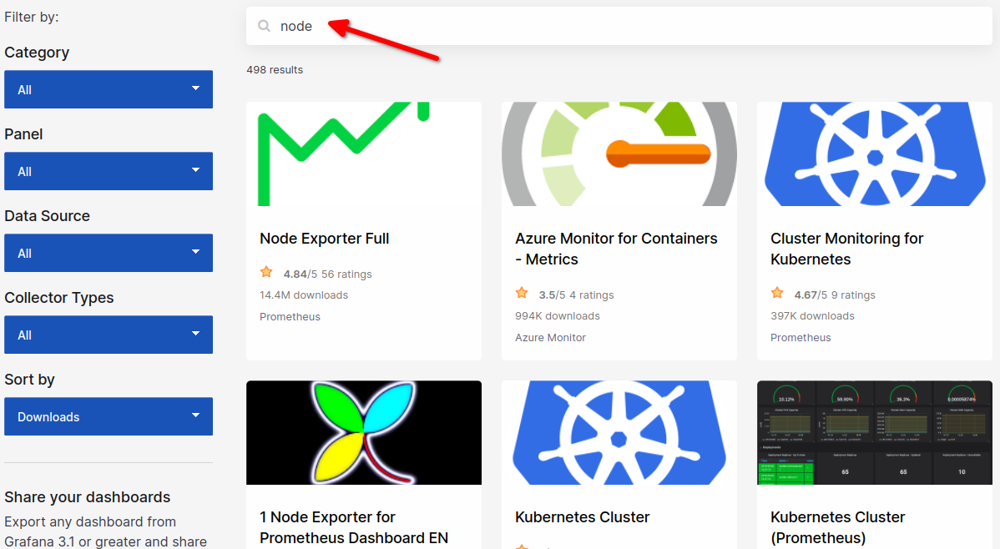

Açılan sayfada dashboard'un ID'sini kopyalıyoruz.
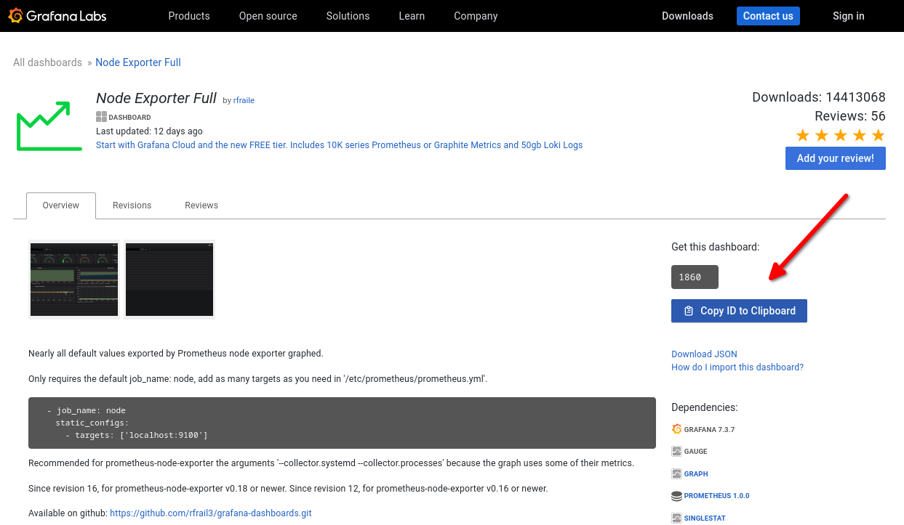

Daha sonra Grafana üzerinde dashboards menüsüne gidip __import__ butonuna tıklayıp sayfada kopyaladığımız id'yi ilgili bölüme yapıştırdıktan sonra  Load butonuna tıklıyoruz. 

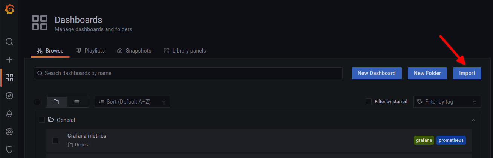
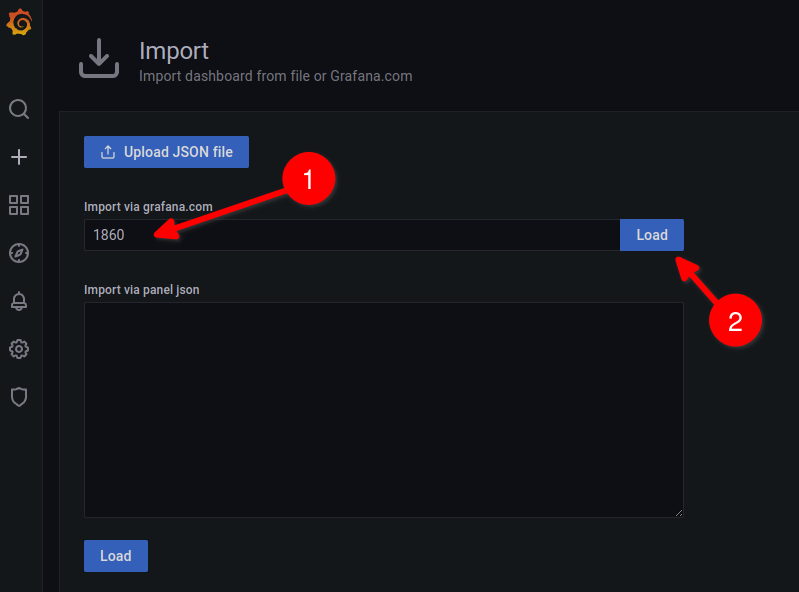


Yeni dashboard yüklenip sayfası açılacaktır. Dashboard üzerinde farklı kategorileri içeren bir çok satır (row) ve bu satırlarda oluşturulmuş bir çok panel görebiliriz.

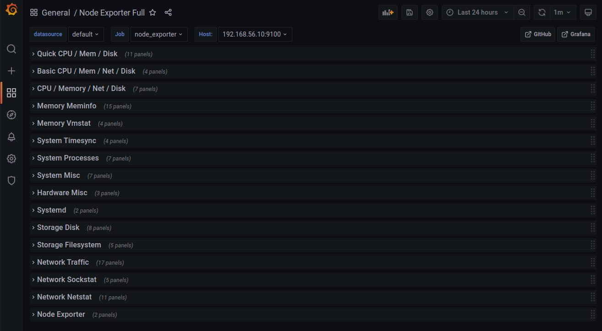

İlk üç row makinemiz hakkında özet bilgileri içeriyor.

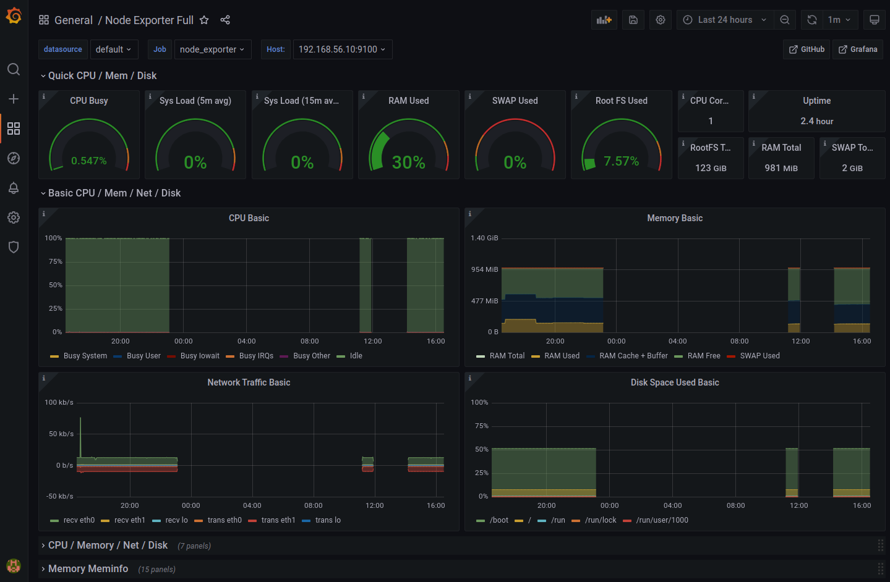

[Grafana Dashboard Download](https://grafana.com/grafana/dashboards) sayfasında farklı kategorilere daha bir çok dashboard görebilirsiniz. Bunların içinde Docker, Kubernetes, veritabanları, Zabbix, sunucular, bulut sistemleri ve daha bir çok dashboard bulmak mümkün.

Dashboard'lar dışında birde Grafana'da kullanılan görselleri ifade eden plugin'lari de[ Grafana plugin download](https://grafana.com/grafana/plugins/) sayfasından yüklemek mümkün.  Bu sayfada paneller, data source'lar (veri kaynakları) ve bu ikisin aynı anda sunan app'ler bulmak mümkün.


Sayfada plugin'leri filtreleyip clock olanı tıklıyoruz. 

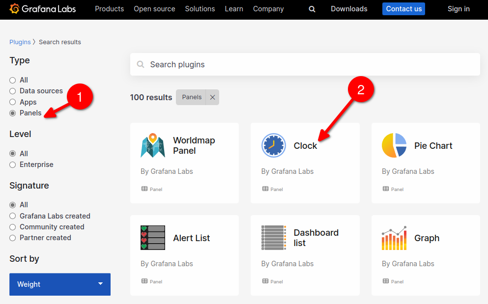

Açılan sayfada _Installation'a_ tıkladığımızda on-prem için iki yöntem olduğunu görebiliyoruz.
- ya cli kullnacağız
- yaa download edip plugin klasörüne extract edeceğiz.

Ben cli'la yapmayı tercih edeceğim. Docker için öncelikle alttaki komutla konteynere giriş yapmak gerekiyor. Tabii ki bunu volume oluşturup plugin klasörünü bağlayarak da yapabilirdik daha doğru olurdu.

```
docker exec -it <container-id-si-gelecek> bash 
```
daha sonra alttaki komutla clock paneli kuruyoruz.

```
grafana-cli plugins install grafana-clock-panel
```

Yükleme bittikten sonra plugins sayfasında yeni clock panelini görebiliriz.
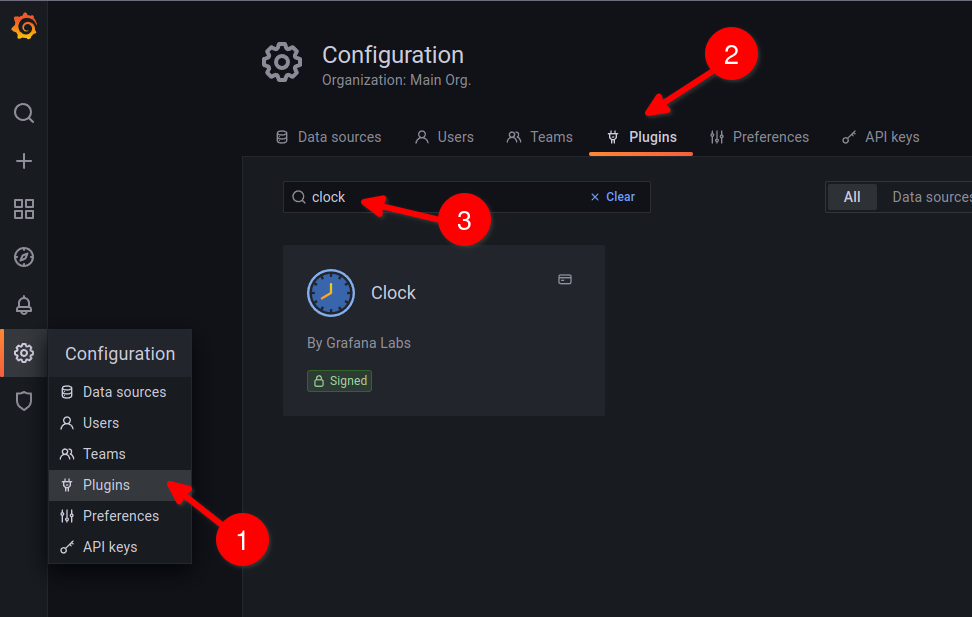

Clock panele tıklayıp açılan sayfadan _install_ butonuna tıklıyoruz.


Şimdi bunu custom bir dashboard üzerinde kullanalım.

## Grafana Dashboard Oluşturmak

Yeni dashboard oluşturmak için dashboards menüsü altında _New Dashboard_ butonuna tıklıyoruz. Açılan sayfada _Add new panel_ linkine tıklıyoruz.

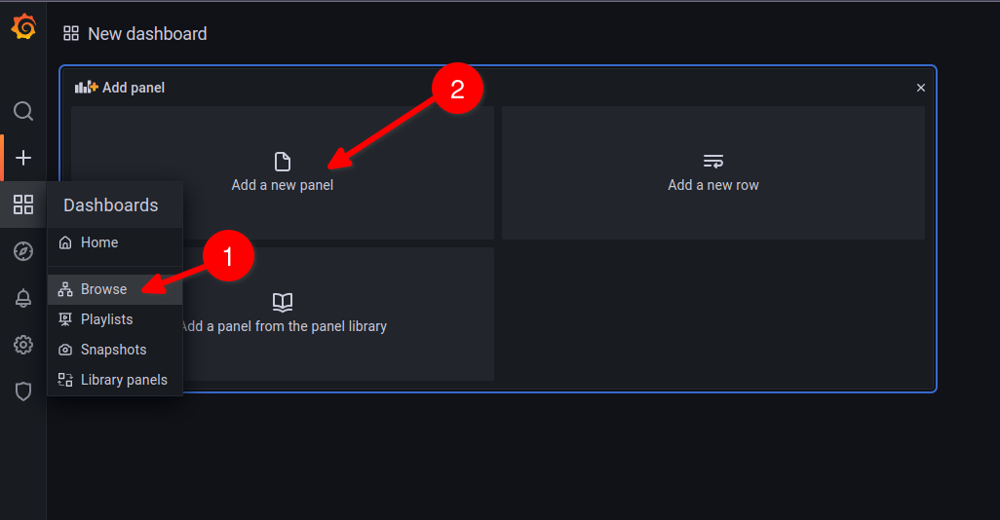

Açılan sada sağ üstten panel tipimizi clock olarak değiştiriyoruz.

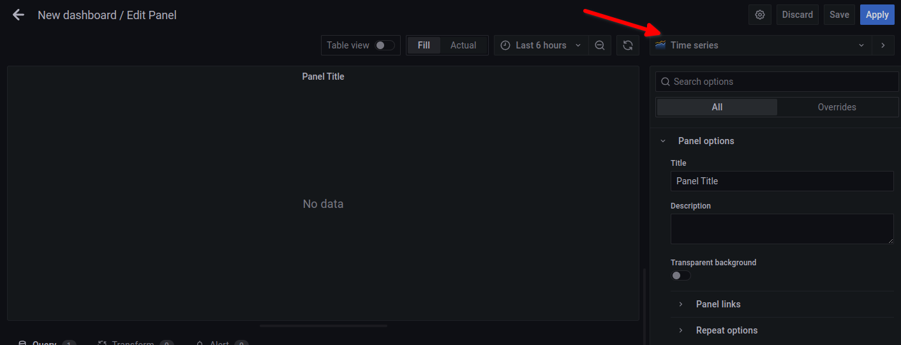

Son olarak clock özelliklerimi sağdaki özellikler bölümünden değiştiriyoruz. Font ayarları, tarihin gösterilmesini ve panel başığını vb ayarlayıp _Apply_ butonuna tıklıyoruz.

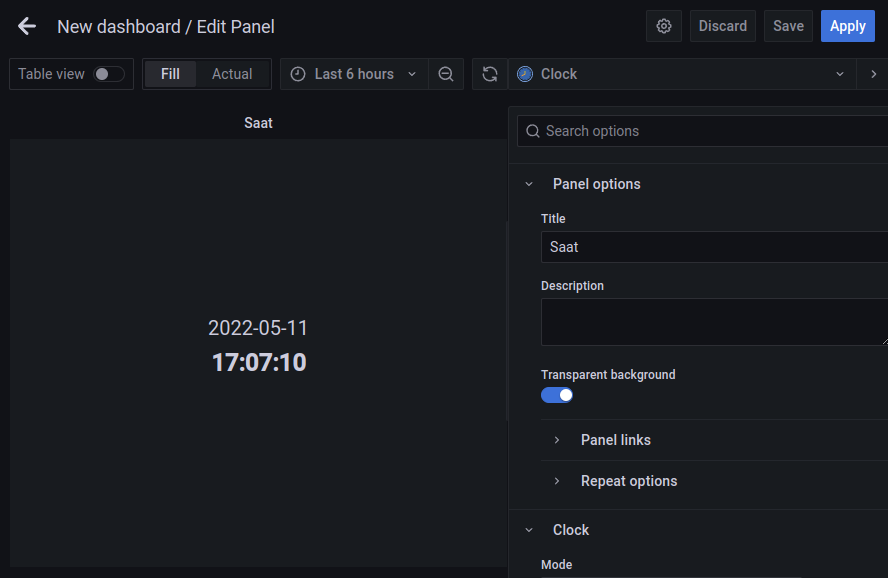

Saatimiz dashboard'a eklenmiş oldu. Birde node exporter'dan cpu metriğini dashboard'a ekleyip bu yazımızı da tamamlayalım.

Bunun için dashboard'un sağ üstünde yer alan _add panel_ butonuna tıklıyoruz.
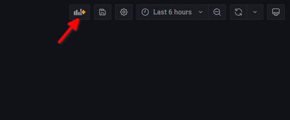

Panel tipimiz _Time Series_ olarak kalabilir.
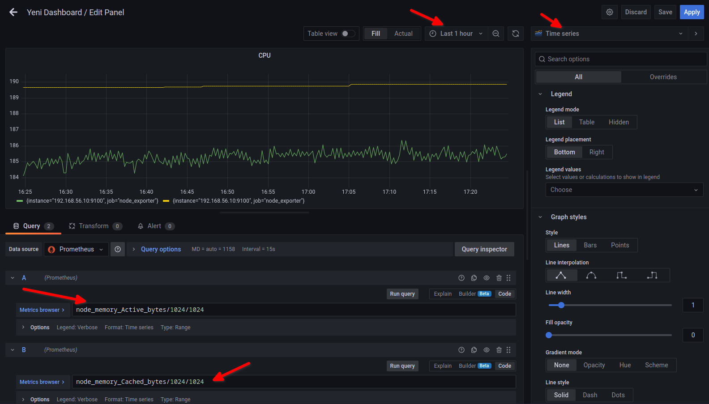

Memory ile ilgili iki metrik ekleyip promQL olarak alttaki satırları yazıyoruz.
```
node_memory_Active_bytes/1024/1024

node_memory_Cached_bytes/1024/1024
```

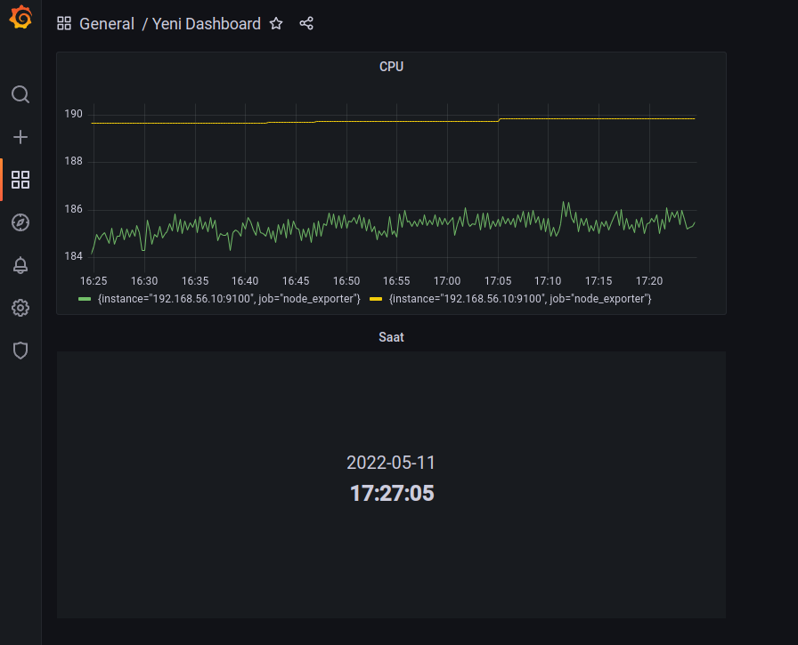

ve sonuç olarak kendi dashboard'umuzu oluşturmuş olduk.

Yazının başında da dediğim gibi amacımız Grafana'yı öğrenmek değil sadece Prometheus ile olan ilişkisini anlamakve entegrasyon işlemlerini yapmaktı. Bu nedenle yazıyı burada bitiyoruz. 

Umarım faydalı olmuştur. 


Yazının diğer makaleleri için alttaki linkleri kullanabilirsiniz.

- [Prometheus'a Giriş](1.prometheus-nedir.md)
- [Prometheus Instrumentation ve Node Exporter Kullanımı](2.instrumentation.md)
- [PromQL Kullanımı](3.quering.md)
- [Prometheus Kural Tanımlama](4.configuring_rules.md)
- [Prometheus Alertmanager Kullanımı](5.alertmanager.md)
- [Prometheus Blackbox Exporter Kullanımı](6.blackbox_exporter.md)
- [Prometheus Pushgateway Exporter Kullanımı](7.pushgateway.md)
- [Prometheus Service Discovery](8.service_discovery.md)
- [Prometheus Grafana Entegrasyonu](9.grafana_integration.md)